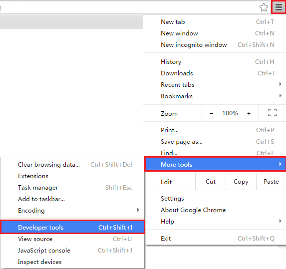
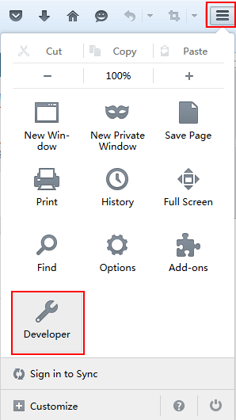
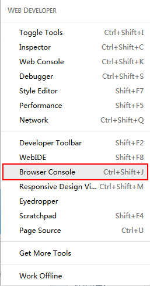
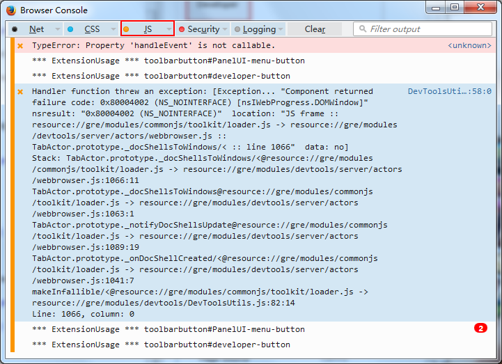

#How to: Debug Browser Preview

For a JS project, there may be something wrong with preview effect after clicking "Run in browser". There are two ways to solve this problem. 

1 Drop the scene files used in the current browser to the list of JS projects src/resource.js. For example, 

   Original resource.js:

   Modified resources. js: 

   

  Add the resources of current scene to g_resources=[...].

2 Enable "developer tool", find the bug according to log. 

**Chrome**

   Customize and control Google Chrome -> More tools -> Developer tools

   

**360 Browser**
  
   Tools -> Developer Tools:

**Firefox**

Settings -> Developer -> Browser Console -> JS

 
   
 

 

