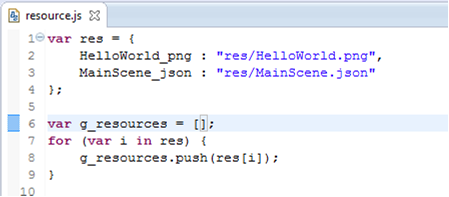
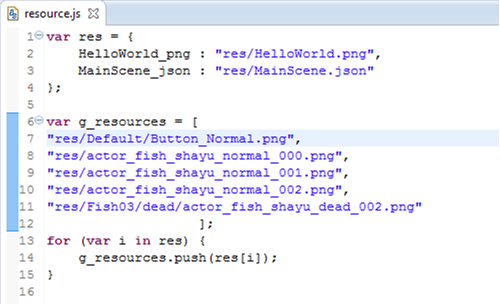

#流覽器運行效果不正確如何定位
如果您的項目是JS項目，點擊“在流覽器運行”，流覽器運行效果不正確，大家可以參考一下兩種方法進行定位。

####1，將當前流覽器載入的場景所用的資源加到：JS項目 src/resource.js裡面，比如：

   原始resource.js：  

  修改後的resource.js：

   

  把當前場景的資源添加到g_resources=[...]裡面。

####2，開啟“開發者工具”，根據log定位問題：

   Chrome流覽器：

   設置-》更多工具-》開發者工具

####360安全流覽器：
  
   工具-》開發人員工具： 

####火狐流覽器：

設置-》開發者-》流覽器控制台-》JS

