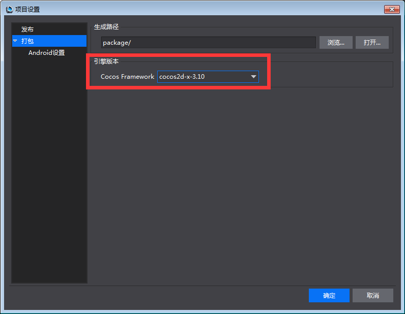

#Issues about Upgrading or Downgrading Framework#

**Based on version 3.10 and later cocos2d-x:**

Is no longer supported by switching Cocos Framework version for automatic upgrades, support supports manual upgrade, as follows:

Create a project (Project 1) based on the new matching Framework. Find the original project (Project 2) folders before upgrading Framework. Compare files of Project 1 with those of Project 2. Manually merge files in Classes, proj.android, proj,ios_mac, proj, win32 except files under project folder. 

**Based on cocos2d-x 3.9 and earlier versions:**

Different versions of Framework can be selected. Under Project in the menu bar, select Project Setting -> Package, as shown below,

         

After selecting the matching Framework, the project will upgrade automatically when you run or package them. Files in Classes, proj.android, proj,ios_mac, proj, win32 will redirect to those of the new matching Framework except files under project folder. If there are issues after upgrading Framework, you can try the following method: 

Create a project (Project 1) based on the new matching Framework. Find the original project (Project 2) folders before upgrading Framework. Compare files of Project 1 with those of Project 2. Manually merge files in Classes, proj.android, proj,ios_mac, proj, win32 except files under project folder. 
