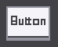

## ボタンについて

### アイコン

## 説明

ボタンサブクラスはタッチスクリーン上におけるボタンを実装します。このボタンはウィジェットのサブクラスでもあります。

ボタンには,タイトル,画像やその他の外観を飾るアトリビュートを設定できます。設定するための関数を使用することでも,違ったアトリビュートを設定することが出来ます。

## Generalの項目について

リンクはこちら [General Property](../widget/general_property.md)

## Featureの項目について

#### Disabled stateについて

Disabled状態の時に表示する画像(png/jpg)を設定出来ます。

#### Pressed stateについて

Pressed状態の時に表示する画像(png/jpg)を設定出来ます。

#### Normal stateについて

Normal状態の時に表示する画像(png/jpg)を設定出来ます。

#### Font styleについて

タイトルで表示する文字列のフォントを設定できます。サポートされているのはArial,boldもしくはMicrosoft Yaheiです。
.ttfの拡張子を持つファイルをドラッグ&ドロップすることでフォントスタイルを変えることも出来ます。

#### Label colorについて

ラベルの色を替えることが出来ます。

#### Textについて

表示する文字列を入力できます。

#### Font sizeについて

フォントのサイズを設定できます。