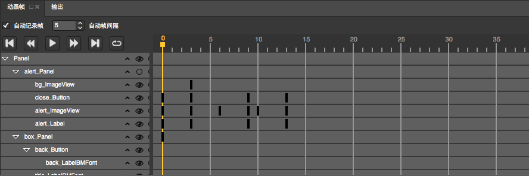
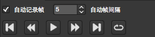

# 动画帧面板

## 简介

动画帧面板主要用户动画的编辑，它将记录在不同时间点每一个节点是否有变化。

## 功能

### 动画播放

- 播放动画：点击将开始播放当前选择动画。
- 停止动画：停止当前播放动画
- 添加关键帧：鼠标选中需要添加关键帧的位置，点击将添加一个关键帧。
- 循环动画：勾选将循环播放动画
- 帧播放的间隔时间：可以通过设置间隔时间来控制动画运行的快慢。
- 鼠标位置在第几帧：显示鼠标放置在第几帧便于用户精确添加关键帧。

### 帧操作

- 添加帧  

	1. 如上图所示：右键添加关键帧就会在鼠标位置创建一个灰色的椭圆作为关键帧的标记。                
	2. 也可以通过左上角的添加关键帧按钮进行添加。

- 删除帧

如上图所示：右键删除帧就会删除当前选中的关键帧，即删除当前选中的椭圆标记。

- 移动帧

选中关键帧的椭圆标记经过鼠标拖拽可以移动你想要的位置。
