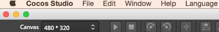

# Menu Bar

## Overview

The menu display a series of commands.Most of the menu on the menu bar, toolbar at the top of the screen.
The menu bar is a collection of editor that is commonly used in operation.Mainly divided into the file, edit, view, help, language five categories for the operation of the whole editor.  
 
**Note：**
- Under "OS X" operating system , only selected the Cocos Studio window, can see it in the operating system's toolbar.While in the "Windows" operating system, displayed in the Cocos Studio to run at the top of the window.

## Menu

### Cocos Studio
Only display in "OS X" operating system.

This menu item used to introduce:

-  About "Cocos Studio"
- Exit

### File（ALT+F）

- New Project (Ctrl + N)

Creates a new project. If a project is already opened, Cocos Studio prompts you to save the current project. When you set up a new project, specify the project name and location.
 
**Note**：  
	1. ：The project name can't contain the following symbols : "?", "`", "\", "*", "<", ">","|"" 
	2.  When Cocos Studio is running on Windows XP, do not put the project on your desktop.
	3.  For all Windows operating systems, do not put the project under the system directory.

- Open Project(Ctrl+O)   
	Opens the existing project.
-  Close Project  
	Closes the opened project.
-  Save Project(Ctrl-S) 
	Saves the opened project.
- Save as(Ctrl-Shift+S)  

	Saves the project as a new project（ver 1.1 or later）.

-  Export project

	Export current project.

-  Import template  
	Imports the existing project.   
		Note:

		1. Cocos Studio only supports importing the json files which are exported by UI editor.
		2. Before you import json files, Cocos Studio will import all the resources which are under the same directory to Cocos Studio.

- Exit（Alt+F4）  
	Closes the editor. If the project is modified, it will prompt you to save the project.

----------

#### Edit（ALT+E）

-  Undo(Ctrl+Z)
	Undos the last operation.
-  Redo(Ctrl+Y)
  	Repeats the last undo operation.

----------
#### Window（ALT+W）  

- Object Structure
	Opens Object Structure windows
- Property
	Opens Property windows.
- Resources
	Opens Resources windows.
- Canvas List
	Opens Canvas List windows.
- Output
	Opens the Output windows.
- Start page windows
	Opens the Start page window of the UI editor.
- Reset windows layout
	Resets Cocos Studio's window layout to its default value.
----------

#### Help(ALT+H)

- See the help（F1）   
	See the online help documentation.
- About "Cocos Studio"   
	Open the 
- The new version check up.
	Check whether there is a new version, version to upgrade.

----------

#### Language(ALT+L)
- English

Sets English as the editor's default language. It will take effect only after relaunching your editor.

- Chinese

Sets Chinese as the editor's default language. It will take effect only after relaunching your editor.
