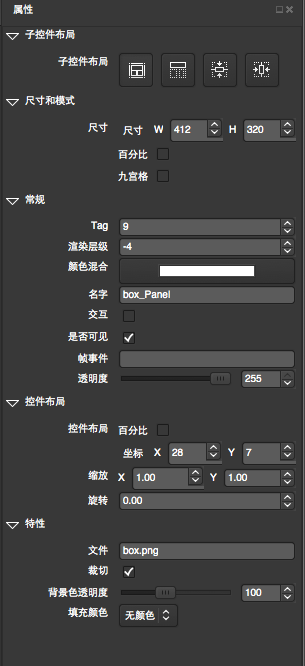

# Property Panel

## Overview

Properties panel is used to describe the properties of the currently selected control panel, and the main operation is controlled by the properties box to control, and real-time display in rendering area.At the same time in the other panel will also real-time response to the operation of the controls in the property box.

## Functionality

### General

For more information, see[widget General Property](../widget/general_property.md)。

### Size And Mode

For more information, see[widget General Property](../widget/general_property.md)。

### Layout

For more information, see[widget General Property](../widget/general_property.md)。

### Feature

Feature sets the widget's properties. Every widget will have its own unique properties. For more information, see each widget's detailed page in this List.

* [Button](../widget/button.md)
* [Check Box](../widget/checkbox.md)
* [Sprite](../widget/sprite.md)
* [ImageView](../widget/imageview.md)
* [LabelAtlas](../widget/labelatlas.md)
* [LabelBMFont](../widget/labelbmfont.md)
* [LoadingBar](../widget/loadingbar.md)
* [Slider](../widget/slider.md)
* [Text](../widget/text.md)
* [TextField](../widget/textfield.md)
* [Layout](../widget/layout.md)
* [ScrollView](../widget/scrollview.md)
* [ListView](../widget/listview.md)
* [PageView](../widget/pageview.md)

### Children Widget Layout

For more information, see[widget General Property](../widget/general_property.md)
