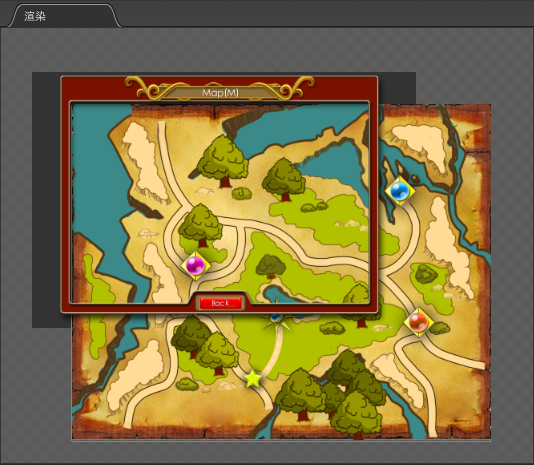
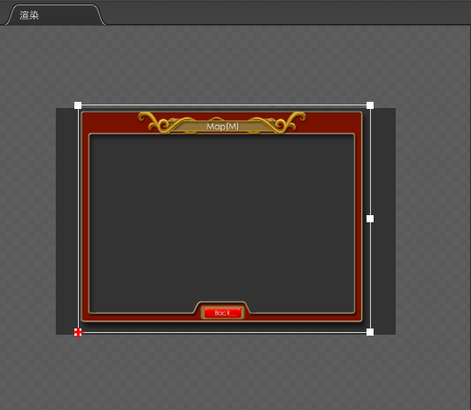
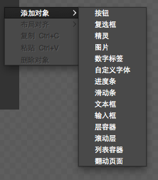
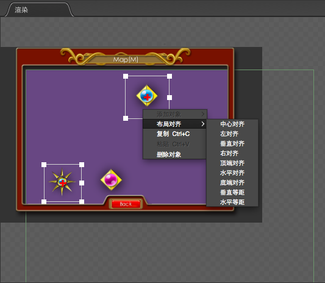

# 渲染面板

## 简介

渲染窗口是编辑的主要工作区域，提供实时的效果预览，及时反映所有的操作以及属性的改变。

## 视图操作
### 移动视图
按住空格键并点击鼠标左键进行移动操作将调整渲染区的位置。

       在Windows系统下，可以按住鼠标中键拖拽视图。

### 缩放视图

- 使用标准鼠标可以通过滚轮前后滚动来缩放渲染区视图
- 除了通过鼠标滚动来缩放视图，还可以调整编辑器右下角的[状态栏](./../sssss/zh.md)视图滑动条或缩放比例下拉菜单中调整视图缩放。

## 功能

### 框选

按住鼠标左键并移动，渲染区中将跟随鼠标绘制一个矩形区域，任何包含在该矩形的控件豆浆呈选中状态。选中多个控件后可以进行整体的复制，删除等操作或设置

### 调整

*   1，2，4，5处可以通过鼠标调整控件的大小，对控件进行伸缩操作（按住Shift时为等比缩放）；
*   3处可以对控件进行旋转操作；
*   6处为锚点

## 右键菜单
### 添加对象

选择一种控件类型并添加到当前控件，如果未选中任何控件则默认添加到根节点。

### 布局对齐

<table border="1" cellspacing="0" cellpadding="0" >

               <tr>
                 <td width="71">中心对齐</td>
                 <td width="196">将所选控件进行中心点对齐</td>
               </tr>
               <tr>
                 <td>左对齐</td>
                 <td>将所选控件进行左对齐</td>
               </tr>
               <tr>
                 <td>垂直对齐</td>
                 <td>将所选控件进行垂直对齐</td>
               </tr>
               <tr>
                 <td>右对齐</td>
                 <td>将所选控件进行右对齐</td>
               </tr>
               <tr>
                 <td>顶对齐</td>
                 <td>将所选控件进行顶对齐</td>
               </tr>
			   <tr>
                 <td>水平对齐</td>
                 <td>将所选控件进行水平对齐</td>
               </tr>

               <tr>
                 <td>底端对齐</td>
                 <td>将所选控件进行底端对齐</td>
               </tr>
               <tr>
                 <td>水平对齐</td>
                 <td>将所选控件进行水平对齐</td>
               </tr>

               <tr>
                 <td>垂直等距</td>
                 <td>将所选控件垂直方向垂直等距部分</td>
               </tr>
			   <tr>
                 <td>水平等距</td>
                 <td>将所选控件水平方向垂直等距部分</td>
               </tr>
</table>

### 删除对象

将所选控件删除
若没选中控件，该菜单项被屏蔽。

### 复制

将所选控件复制粘贴板内。
若没选中控件，该菜单项被屏蔽。

### 粘贴

将粘贴版本的控件粘贴到当前控件内。
若没被拷贝的控件，该菜单项被屏蔽。
