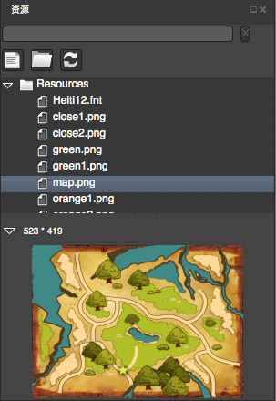

# リソースパネル

## 概要
------

リソースパネルはプロジェクトで使用するリソースの管理を行い,現在のプロジェクトのリソースフォルダ内に配置されたものを対象にするので,任意のリソースファイルをエディタで使用できるようにするには,フォルダに追加する必要があります。

- エディタ上でリソースファイルに変更をかけた場合,エディタが自動でリソースリストをリフレッシュしてくれます。
- それ以外の方法でリソースファイルに変更をかけた場合,手動でリフレッシュを実行する必要があります。

## 機能
-------
### 検索

使用したいリソースを検索します。CocosStudioは検索フィールドへの入力に応じて検索を実行します。

### ファイルの追加

1. ディスクから選択したファイルをインポートし,CocosStudioで使用することができます。また,複数ファイルのインポートオプションをサポートします。

2. 重複する名前を持つファイルはインポートすることができません。

### フォルダーの追加
   
1. ディスクから選択したフォルダをインポートし,CocosStudioで使用することができます。

2. 重複する名前を持つフォルダはインポートすることができません。

### リフレッシュ

手動でファイルやフォルダを削除,または追加した後,プロジェクトのリソースリストを更新するにはこのオプションを選択してください。

### プレビュー

選択したイメージを,下部のプレビューエリアに表示させます。デフォルトでは,このプレビューエリアは折り畳まれているので,開くために左上隅の三角形のシンボルをクリックしてください。

### リソースの構成にドラッグアンドドロップ

ドラッグアンドドロップされた.PNGもしくは. JPGの拡張子を持つファイルを,コントロールボックスは適切に配置します。描画エリアにドラッグアンドドロップした場合,自動的に"spirit"というコントロールパネルを作成し,テクスチャレンダリングリソースを構成します。
##  右クリックから実行できる機能
------
### エクスプローラーの起動
  
選択したファイルの置かれている場所を開きます。

### リネーム

リソースの名前を変更します。このオプションはPlist,PSD画像のリネーム機能をサポートしていません。 

### 削除

選択されているファイルを削除します。

### インポート

- ファイルをインポート

ディスクから選択したファイルをインポートすることができます。また,複数ファイルのインポートオプションをサポートします。

-  フォルダをインポート

ディスクから選択したフォルダをインポートすることができます。

### リソースのリフレッシュ

ユーザーが手動でリソースフォルダ内のファイルに変更をかけた場合,リフレッシュを実行する必要があります。