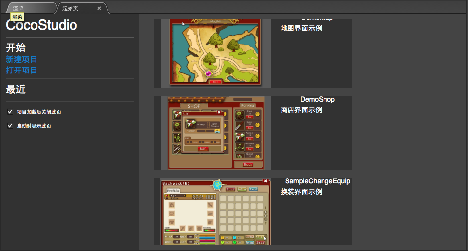

# 起始页面

## 概览

起始页面是一个集成常用功能界面，以便快速进入工作或学习的状态。提供了项目创建操作，历史项目列表，示例等。

## 功能

### 开始

提供快捷菜单，包括新建项目,打开项目功能

- 新建项目
打开新建项目窗口，创建一个新的项目。
- 打开项目
打开系统资源管理窗口，用于查找并打开已有工程。

### 最近
显示最近编辑的项目，快速打开最近项目。

### 示例
编辑器提供的示例，可以通过这些示例学习Cocos Studio的制作与使用。