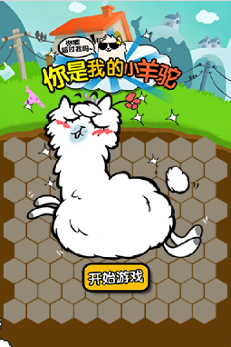
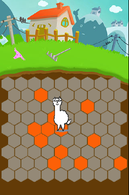
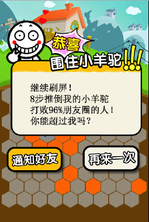
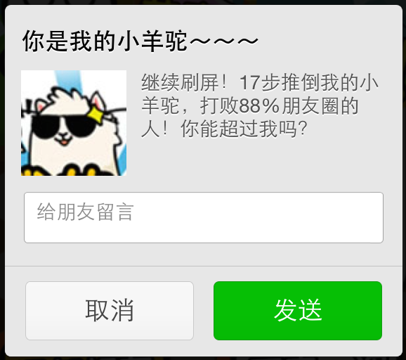

# 如何用Cocos2d-JS制作一个神经猫游戏

## 前言

一夜之间，微信上一款叫《围住神经猫》的小游戏火了。它的玩法很简单，用最少的步数把一直神经兮兮的猫围死。
7月22号上线以来，3天,500万用户和1亿访问，想必各位程序猿都按耐不住了，想实现自己的神经猫游戏。

在这篇教程里，我会教大家如何用Cocos2d-JS来实现一个神经猫这样的游戏。
让我们先看下游戏最后完成了的效果图:

  

你可能注意到了，神经猫换成了可爱的小羊驼：）

在线游戏地址：[http://app9.download.anzhuoshangdian.com/xyt/?from=singlemessage&isappinstalled=0](http://app9.download.anzhuoshangdian.com/xyt/?from=singlemessage&isappinstalled=0)


## 游戏分析

三个界面基本上就是整个游戏的全部内容：

1. 左边的是主界面，展示游戏名称以及主角，让玩家对游戏的整体画风有个大概的印象。
2. 中间的是游戏界面，点击空格防止橙色六边形砖块来围堵小羊驼。
3. 右边的是游戏成功或失败的界面。

整个游戏的主逻辑都在游戏界面中完成。

玩法是这样：

1. 游戏初始化开始，小羊驼始终是站在地图中间，在地图的其他区域随机生产一些位置随机的砖块。
2. 玩家点击一个空白区域，放置一个砖块来围堵羊驼。
3. 羊驼AI寻路移动一步。
4. 循环2和3，直到羊驼被围堵在一个圈里面（游戏成功），或羊驼到达地图边界（游戏失败）

整个游戏的思路理清楚了，接下来我们开始进入编码阶段。

## 开发环境与新建项目

本教程开发基于当前最新的[Download v3.0RC1](http://www.cocos2d-x.org/filedown/cocos2d-js-v3.0-rc1.zip).

下载引擎并解压到磁盘的某个目录。

开打控制台，输入下面的命令来新建项目。

```
$cd cocos2d-js-v3.0-rc1/tools/cocos2d-console/bin
$./cocos new -l js --no-native
$cd MyJSGame/
$../cocos run -p web
```

环境搭建并不是这篇文章的重点，更详细的信息可以参考：[《搭建 Cocos2d-JS 开发环境》](http://cocos2d-x.org/docs/tutorial/framework/html5/parkour-game-with-javascript-v3.0/chapter1/zh)

## 主界面实现

游戏的入口代码在main.js中，用编辑器打开并修改为下面的代码。

```
cc.game.onStart = function(){
    // 1.
    cc.view.adjustViewPort(true);

    // 2.
    if (cc.sys.isMobile)
        cc.view.setDesignResolutionSize(320,500,cc.ResolutionPolicy.FIXED_WIDTH);
    else cc.view.setDesignResolutionSize(320,480,cc.ResolutionPolicy.SHOW_ALL);
    cc.view.resizeWithBrowserSize(true);

    
    // 3.
    cc.LoaderScene.preload(resources, function () {
        // 4.
        gameScene = new GameScene();
        cc.director.runScene(gameScene);
    }, this);
};

cc.game.run();
```

关键点解析如下：

1. 设置浏览器meta来适配屏幕，引擎内部会根据屏幕大小来设置meta的viewport值，会达到更好的屏幕适配效果。
2. 针对手机浏览器和PC浏览器启用不同的分辨率适配策略。
3. 预加载图片声音等资源。
	cc.LoaderScene.preload会生成一个“加载中 x％”的界面，等待资源加载结束后，调用第二个参数传入的匿名函数。
	对于基于html的游戏，页面是放在服务器端供浏览器下载的，为了获得流畅的用户体验，cc.LoaderScene.preload让浏览器先把远程服务器的资源缓存到本地。需要预加载的资源定义在src/Resources.js文件中。
4. 启动游戏的第一个场景。

主界面的由两个层实现，

1. GameLayer层，游戏主逻辑层，在未初始化地图矩阵时，它只显示背景地图。
2. StartUI层，显示logo图片和开始游戏按钮。

GameScene的初始化代码如下：

```
var GameScene = cc.Scene.extend({
    onEnter : function () {
        this._super();

        var bg = new cc.Sprite(res.bg);
        bg.attr({
            anchorX : 0.5,
            anchorY : 0.5,
            x : cc.winSize.width/2,
            y : cc.winSize.height/2
        });
        this.addChild(bg);

        layers.game = new GameLayer();
        this.addChild(layers.game);

        layers.startUI = new StartUI();
        this.addChild(layers.startUI);

        layers.winUI = new ResultUI(true);
        layers.loseUI = new ResultUI(false);
        layers.shareUI = new ShareUI();
    }
});
```

由引擎提供的cc.Scene.extend方法，让js能实现高级面向对象语言的继承特性。
onEnter方法是场景初始化完成即将展示的消息回调，在onEnter中必须调用`this._super();`来确保Scene被正确的初始化。

整个游戏的设计只有一个scene，界面之间的切换由layer来实现，这可能不是一个最优的设计，但也提供另一种思路。
为了用layer来实现切换，全局变量layers存储了各层的一个实例。

GameLayer我们在下一章节中详细讲解。

StartUI的实现如下：

```
var StartUI = cc.Layer.extend({
    ctor : function () {
        this._super();

        var start = new cc.Sprite(res.start);
        start.x = cc.winSize.width/2;
        start.y = cc.winSize.height/2 + 20;
        this.addChild(start);
    },
    onEnter : function () {
        this._super();

        cc.eventManager.addListener({
            event: cc.EventListener.TOUCH_ALL_AT_ONCE,
            onTouchesEnded: function (touches, event) {
                var touch = touches[0];
                var pos = touch.getLocation();
                if (pos.y < cc.winSize.height/3) {
                    layers.game.initGame();
                    layers.startUI.removeFromParent();
                }
            }
        }, this);
    }
});
```

cc.Layer.extend作用同cc.Scene.extend一样，只不过是一个扩展Scene，一个扩展Layer。ctor是Cocos2d-JS中的构造函数，在ctor中必须调用`this._super();`以确保正确的初始化。

在onEnter中，我们为StartUI层绑定事件监听，判断触摸点的位置坐标来触发scene切换。

细心的读者可能要问，为什么不用Menu控件？
当前的Cocos2d-JS版本已实现模块化，可以选择只加载游戏中用到的模块，已减少最终打包size。
为了不加入Menu模块，这里使用了最简单的触摸点坐标判断来实现通用的事情。

## 游戏界面的实现

### 橙色块的初始化

游戏地图区域是由9*9的六边形方块组成的，首先用InActive的图片初始化一边矩阵。相关代码如下：

```
        var ox = x = y = 0, odd = false, block, tex = this.batch.texture;
        for (var r = 0; r < ROW; r++) {
            y = BLOCK_YREGION * r;
            ox = odd * OFFSET_ODD;
            for (var c = 0; c < COL; c++) {
                x = ox + BLOCK_XREGION * c;
                block = new cc.Sprite(tex, BLOCK2_RECT);
                block.attr({
                    anchorX : 0,
                    anchorY : 0,
                    x : x,
                    y : y,
                    width : BLOCK_W,
                    height : BLOCK_H
                });
                this.batch.addChild(block);
            }
            odd = !odd;
        }
```

每次循环odd改变，已实现上下错位的排布。
attr是Node基类的新方法，可以方便的一次性设置多个属性。

橙色方块的初始化是由initGame函数来完成。
先来看initGame的实现：

```
    initGame : function() {
        if (this.inited) return;

        this.player_c = this.player_r = 4;
        this.step = 0;
		
		// 1.
        for (var i = 0, l = this.active_nodes.length; i < l; i++) {
            this.active_nodes[i].removeFromParent();
        }
        this.active_nodes = [];
        for (var r = 0; r < ROW; r++) {
            for (var c = 0; c < COL; c++) {
                this.active_blocks[r][c] = false;
            }
        }

		// 2.
        this.randomBlocks();

		// 3.
        this.player.attr({
            anchorX : 0.5,
            anchorY : 0,
            x : OFFSET_X + BLOCK_XREGION * this.player_c + BLOCK_W/2,
            y : OFFSET_Y + BLOCK_YREGION * this.player_r - 5
        });
        this.player.stopAllActions();
        this.player.runAction(this.moving_action);

        this.inited = true;
    },
```
要点解析如下：

1. 为了方便逻辑处理，这里用了active_nodes和active_blocks来记录被激活的方块。在初始化矩阵前，需要清理上一次游戏已生成的橙色方块。active_nodes存储精灵实例，active_blocks记录精灵的矩阵坐标。
2. randomBlocks函数生成随机橙色砖块。
首先产生一个7-20的随机数，也就是确定橙色块的数量。然后循环确定每一个块的位置坐标，当然位置坐标也是随机确定的。
3. 复位小羊驼的位置以及动画。

### 响应触摸事件

按照我们之前的分析，游戏界面初始化完成后，需要等待用户指令才能进行下一步的游戏。

相关代码如下：

```
		// 1.
        cc.eventManager.addListener({
        	// 2.
            event: cc.EventListener.TOUCH_ALL_AT_ONCE,
            // 3.
            onTouchesBegan: function (touches, event) {
                var touch = touches[0];
                var pos = touch.getLocation();
                var target = event.getCurrentTarget();
                if (!target.inited) return;

                pos.y -= OFFSET_Y;
                var r = Math.floor(pos.y / BLOCK_YREGION);
                pos.x -= OFFSET_X + (r%2==1) * OFFSET_ODD;
                var c = Math.floor(pos.x / BLOCK_XREGION);
                if (c >= 0 && r >= 0 && c < COL && r < ROW) {
                    if (target.activateBlock(r, c)) {
                        target.step ++;
                        target.movePlayer();
                    }
                }
            }
        }, this);
```

1. cc.eventManager.addListener加入新的事件监听。
2. 设置事件监听模式为TOUCH_ALL_AT_ONCE。
3. 重写onTouchesBegan方法，判断触摸点的坐标，确定是哪个块被点击，并做响应的处理。
activateBlock方法在对应的矩阵位置加入橙色块，并更新状态数组。然后调用movePlayer移动小羊驼。

### 羊驼的移动

整个逻辑的关键是AI.js中的getDistance函数，

getDistance有6个参数：

1. 羊驼所在行号
2. 羊驼所在列号
3. 前进方向，l_choices,r_choices,t_choices或b_choices
4. 激活块的记录数组
5. 辅助记录表，记录在寻路算法中某个节点是不是已经被访问过。
6. 最短路径

返回值有三种情况：

1. 羊驼到达地图边界，返回羊驼坐标和最短路径0
2. 羊驼还在地图中，返回羊驼的下一个坐标值和最短路径cost
3. -1表示羊驼被圈住了，但可能可以移动。

getDistance的代码实现如下：

```
var getDistance = function (r, c, dir_choices, activate_blocs, passed, cost) {
    passed[r][c] = true;
    if (r <= 0 || r >= ROW_MINUS_1 || c <= 0 || c >= COL_MINUS_1) {
        return [r, c, cost];
    }

    var odd = (r % 2 == 1) ? 1 : 0;
    var choices = dir_choices[odd];

    var nextr, nextc, result;
    for (var i = 0, l = choices.length; i < l; i++) {
        nextr = r + choices[i][0];
        nextc = c + choices[i][1];

        if (!activate_blocs[nextr][nextc] && !passed[nextr][nextc]) {
            cost ++;
            result = getDistance(nextr, nextc, dir_choices, activate_blocs, passed, cost);
            if (result != -1) {
                result[0] = nextr;
                result[1] = nextc;
                return result;
            }
        }
    }
    return -1;
};
```

在羊驼移动函数movePlayer中，首先通过getDistance来判断上下左右4个方向，来寻找最佳移动方向。根据getDistance的返回结果做相应的逻辑处理。


## 游戏结束界面

游戏结束的两种情况，玩家胜利或失败。

在ResultUI的构造函数中，加入参数win，用来标识是否胜利。而胜利和失败仅仅是显示文字的区别，下方的两个按钮均一样。


在ctor中，根据是否胜利加载不同的图片来显示：

```
   ctor : function (win) {
        this._super();

        this.win = win;
        if (win) {
            this.winPanel = new cc.Sprite(res.succeed);
            this.winPanel.x = cc.winSize.width/2;
            this.winPanel.anchorY = 0.2;
            this.winPanel.y = cc.winSize.height/2;
            this.addChild(this.winPanel);
        }
        else {
            this.losePanel = new cc.Sprite(res.failed);
            this.losePanel.x = cc.winSize.width/2;
            this.losePanel.anchorY = 0.2;
            this.losePanel.y = cc.winSize.height/2;
            this.addChild(this.losePanel);
        }
    }
```

在onEnter中，根据是否胜利加载不同的文字描述：

```
        if (this.win) {
            this.winPanel.removeAllChildren();

            var w = this.winPanel.width, h = this.winPanel.height;
            var label = new cc.LabelTTF("继续刷屏！\n"+step+"步推倒我的小羊驼\n打败"+percent+"%朋友圈的人！\n你能超过我吗？", "宋体", 20);
            label.x = w/2;
            label.y = h/4;
            label.textAlign = cc.LabelTTF.TEXT_ALIGNMENT_CENTER;
            //label.boundingWidth = w;
            label.width = w;
            label.color = cc.color(0, 0, 0);
            this.winPanel.addChild(label);
        }
        else {
            this.losePanel.removeAllChildren();
            var w = this.losePanel.width, h = this.losePanel.height;
            label = new cc.LabelTTF("我滴小羊驼呀它又跑掉了\nT_T 快帮我抓回来！", "宋体", 20);
            label.x = w/2;
            label.y = h/4+5;
            label.textAlign = cc.LabelTTF.TEXT_ALIGNMENT_CENTER;
            //label.boundingWidth = w;
            label.width = w;
            label.color = cc.color(0, 0, 0);
            this.losePanel.addChild(label, 10);
        }
```

"通知好友"按钮加载shareUI层，这个层其实是一个帮助指导界面，指示用户点击微信右上角的分享按钮进行分享。

```
gameScene.addChild(layers.shareUI, 100);
target.win ? share(1, step, percent) : share(2);
```

"再来一次"实现很简单，调用initGame重新初始化矩阵，并移除ResultUI层。

```
layers.game.initGame();
target.win ? layers.winUI.removeFromParent() : layers.loseUI.removeFromParent();
```


## 分享指导界面

在游戏结束界面我们加入了分享按钮。现在我们就来实现分享界面。

分享界面由分享图标和分享说明组成。这和前面的layer创建一样。很简单，唯一的区别是，分享界面是cc.LayerColor(cc.LayerColor支持设置层的颜色)的子类。下面是实现代码：

```
    ctor: function () {
        this._super(cc.color(0, 0, 0, 188), cc.winSize.width, cc.winSize.height);

        var arrow = new cc.Sprite(res.arrow);
        arrow.anchorX = 1;
        arrow.anchorY = 1;
        arrow.x = cc.winSize.width - 15;
        arrow.y = cc.winSize.height - 5;
        this.addChild(arrow);

        var label = new cc.LabelTTF("请点击右上角的菜单按钮\n再点\"分享到朋友圈\"\n让好友们挑战你的分数！", "宋体", 20, cc.size(cc.winSize.width*0.7, 250), cc.TEXT_ALIGNMENT_CENTER);
        label.x = cc.winSize.width/2;
        label.y = cc.winSize.height - 100;
        label.anchorY = 1;
        this.addChild(label);
    },
```

加入touch事件用于移除分享界面：

```
    onEnter: function () {
        this._super();
        cc.eventManager.addListener({
            event: cc.EventListener.TOUCH_ONE_BY_ONE,
            onTouchBegan: function (touch, event) {
                layers.shareUI.removeFromParent();
            }
        }, this);
    }
```

## 微信分享

### 我们需要的功能：

	- 分享到微信朋友圈
	- 分享给微信好友
	- 分享到腾讯微博
	- 关注指定用户

### 实现方式

本功能已经有大神提供了完整的库，地址是：https://github.com/zxlie/WeixinApi ，以下我们做一个简单的使用分析。	
> 注：除特殊说明外，本小节实现均在文件 WeixinApi.js中。

现在我们实现的分享有，发给指定朋友，分享到朋友圈，分享到腾讯微博。对于不同的分享方式，实现方式大同小异，我们主要以分享到朋友圈为例。

#### 分享数据

我们分享的时候需要的数据有：appid，图片，链接，标题，文字内容，例如：



对应在代码中就需要以下数据：

```
"appid":theData.appId ? theData.appId : '',
"img_url":theData.imgUrl,
"link":theData.link,
"desc":theData.desc,
"title":theData.title, // 注意这里要分享出去的内容是desc
```

#### 数据来源

为了得到数据，我们需要在GameScene.js中实现ResultUI的时候，将以上数据生成出来。
比如胜利时，我们需要显示：

```
var label = new cc.LabelTTF("继续刷屏！\n"+step+"步推倒我的小羊驼\n打败"+percent+"%朋友圈的人！\n你能超过我吗？", "宋体", 20);
```

完成数据后，我们需要判断胜利或失败，并传回ui中显示：

```
target.win ? share(1, step, percent) : share(2);
```                
	
#### 分享回调

为了监测分享的状态，无论分享成功与否我们回调都会上报状态，以便程序处理，我们需要的状态有：
- 用户取消分享
- 分享失败
- 分享成功
所以我们需要以下实现：

```
function (resp) {
    switch (resp.err_msg) {
            // share_timeline:cancel 用户取消
        case 'share_timeline:cancel':
            callbacks.cancel && callbacks.cancel(resp);
            break;
            // share_timeline:fail　发送失败
        case 'share_timeline:fail':
            callbacks.fail && callbacks.fail(resp);
            break;
            // share_timeline:confirm 发送成功
        case 'share_timeline:confirm':
        case 'share_timeline:ok':
            callbacks.confirm && callbacks.confirm(resp);
            break;
    }
    // 无论成功失败都会执行的回调
    callbacks.all && callbacks.all(resp);
}
```

#### WeixinJSBridge

在微信上，通过公众平台推送给用户的文章，是在微信内部直接打开的，用的无外乎就是一个UIWebView控件（IOS上，Android上也差不多）。但特殊的是，微信官方在这里面加了一个默认的Js API--WeixinJSBridge，通过它，能直接在该页面上做分享操作。
以下代码，拿去玩吧：

```
WeixinJSBridge.on('menu:share:timeline', function (argv) {
    if (callbacks.async && callbacks.ready) {
        window["_wx_loadedCb_"] = callbacks.dataLoaded || new Function();
        if(window["_wx_loadedCb_"].toString().indexOf("_wx_loadedCb_") > 0) {
            window["_wx_loadedCb_"] = new Function();
        }
        callbacks.dataLoaded = function (newData) {
            window["_wx_loadedCb_"](newData);
            shareTimeline(newData);
        };
        // 然后就绪
        callbacks.ready && callbacks.ready(argv);
    } else {
        // 就绪状态
        callbacks.ready && callbacks.ready(argv);
        shareTimeline(data);
    }
});
```

最后，赶紧写点诱惑的东东，让用户分享出去吧，这是微信病毒传播的乐趣！


## 后记

你可以在这里获取本教程的全部[源码](./res/yangtuo.zip).