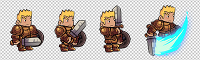
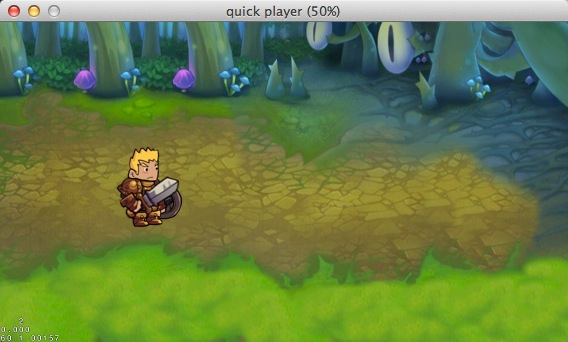

# 使用Quick-Cocos2d-x搭建一个横版过关游戏(二)
前面我们讲过了怎么建立游戏，添加精灵，创建新的类等，这一章里面我们来讲讲怎么用Quick来添加动画和UI。
## 动画

### 添加动画
在游戏中使用的动画有两种，一种是骨骼动画，还有一种是帧动画。目前在2D游戏里使用的更多的是帧动画，我们在这里讲到的也是帧动画，在后面的章节中我们会谈到Quick里怎样使用骨骼动画。
帧动画，顾名思义，就是通过定时播放一帧一帧的图片，使得看起来像动画。比如下面这样几帧图片：

当我们按照一定的时间间隔来显示这几帧图片时，就成了帧动画。
打开Player.lua文件，添加方法Player:addAnimation()，代码如下：

	function Player:addAnimation()
	    local animationNames = {"walk", "attack", "dead"}
	    local animationFrameNum = {4, 4, 4}

	    for i = 1, #animationNames do
	        local frames = display.newFrames("player1-" .. i .. "-%d.png", 1, animationFrameNum[i])
	        local animation = display.newAnimation(frames, 0.2)
	        display.setAnimationCache("player1-" .. animationNames[i], animation)
	    end
	end

我们给Player添加了3个帧动画，分别是walk,attack,dead，对应的图片文件名称分别是：Player1-1-1.png,Player1-1-2.png,Player1-1-3.png,Player1-2-1.png，命名方式是`角色-动作-动作帧.png`。
在Quick中要新建一个帧动画的方式：

- 新建一个SpriteFrames

		local frames = display.newFrames("player1-" .. i .. "-%d.png", 1, animationFrameNum[i])
		
- 通过SpriteFrames创建一个Animation，时间间隔为0.2s

		local animation = display.newAnimation(frames, 0.2)
		
- 将动画插入到AnimationCache中，如果是当时使用的话可以不插入到AnimationCache中，如果是经常需要使用的话，放到AnimationCache中会大大的提高效率。

		display.setAnimationCache("player1-" .. animationNames[i], animation)

### 播放动画

为了便于调用动画，我们为每个动画添加了一个方法

	function Player:walkTo(pos, callback)

	    local function moveStop()
	        transition.stopTarget(self)
	        if callback then
	            callback()
	        end
	    end

	    local currentPos = CCPoint(CCNode.getPositionX(self), CCNode.getPositionY(self))
	    local destPos = CCPoint(pos.x, pos.y)
	    local posDiff = cc.PointDistance(currentPos, destPos)
	    local seq = transition.sequence({CCMoveTo:create(5 * posDiff / display.width, CCPoint(pos.x,pos.y)), CCCallFunc:create(moveStop)})
	    transition.playAnimationForever(self, display.getAnimationCache("player1-walk"))
	    self:runAction(seq)
	    return true
	end

	function Player:attack()
	    transition.playAnimationOnce(self, display.getAnimationCache("player1-attack"))
	end

	function Player:dead()
	    transition.playAnimationOnce(self, display.getAnimationCache("player1-dead"))
	end

在walkTo方法的参数中，我们有两个参数，分别是目标位置和完成后的回调。

## 添加触摸事件处理

### Quick中的触摸机制
因为Cocos2d-x中原本的触摸机制在实际使用中感觉不合理的地方太多了，廖大在Quick中对原本的触摸机制有了比较大的改动。现在的触摸是根据目标的显示层级来进行的分发，而且在Quick中任何CCNode的对象都能够接收触摸事件，这样的话就不需要再为触摸精灵之类的事情费神了。具体的说明可以参考[Quick网站上的文章](http://quick.cocos.org/?p=1504)。

### 给场景添加触摸

打开MainScene.lua，添加一个方法，名为MainScene:addTouchLayer()，复制下面的代码：
	
	    function MainScene:addTouchLayer()
        local function onTouch(eventName, x, y)
            if eventName == "began" then
                self.player:walkTo({x=x,y=y})
            end
        end

        self.layerTouch = display.newLayer()
        self.layerTouch:addNodeEventListener(cc.NODE_TOUCH_EVENT, function(event)
            return onTouch(event.name, event.x, event.y)
        end)
        self.layerTouch:setTouchEnabled(true)
        self.layerTouch:setPosition(ccp(0,0))
        self.layerTouch:setContentSize(CCSizeMake(display.width, display.height))
        self:addChild(self.layerTouch)
    end

给Layer添加Touch事件是在通过调用方法addNodeEventListener()来实现的。第一个参数是要侦听的消息类型，具体的事件类型定义可以看Event.lua文件。第二个参数是事件响应函数。在这里我们在回调里让玩家角色移动到点中的位置。在MainScene:ctor()中添加self:addTouchLayer()。
再刷新下Player，点点鼠标，是不是角色跟着在动呢？

