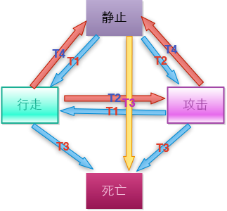
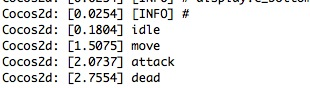
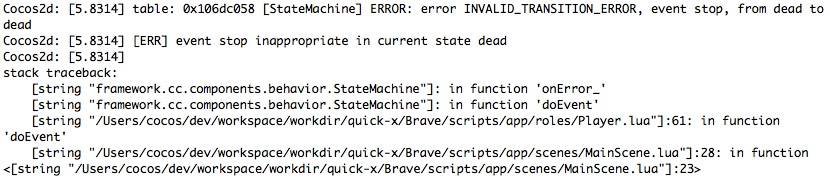

#使用Quick-Cocos2d-x搭建一个横版过关游戏(三)
在这一章，我们来说下Quick中的状态机的设计和使用方式。
在游戏设计中，经常会用到状态机的概念。那么什么是状态机呢？其实状态机就是状态转移图。举个最简单的例子。在游戏中人有四个状态，分别是：`静止，行走，攻击和死亡`。触发的条件有`用户点击屏幕（t1），用户选中敌人（t2），用户被敌人砍没血（t3），用户放弃选中(t4)`。所以状态机就是 `静止-( t3) ->死亡；静止-（t1）->行走；静止-（t2）->攻击；行走-（t3）->死亡；行走-（t2）->攻击；攻击-（t3）->死亡；行走- (t4) ->静止；攻击- (t4) -> 静止`等等。就是这样状态在不同的条件下跳转到自己或不同状态。如下图所示：

在上面的状态转换图中(图比较丑，请忽略……),我们可以很容易的看到人物的四个状态之间的转换关系。每个状态都有一个触发条件，当你触发T1的时候，如果用户是静止的，那么状态机会转换到行走状态，当行走执行结束时，状态机又会转换到静止状态。

## Quick中的状态机机制

Quick下的状态机是从Javascript的状态机改过来的，但是充分的结合了Lua语言的优点，使用table大大简化了状态机的编写，同时也方便了开发人员的工作量。
为了更好的学习状态机，我们先来分析下Quick中的状态机的例子。
首先，我们打开quick-x/sample/statemachine/scripts/scenes/MainScene.lua。先看MainScene:ctor()方法

	self.fsm_ = {}
    cc.GameObject.extend(self.fsm_)
        :addComponent("components.behavior.StateMachine")
        :exportMethods()
        
 这样就创建了一个状态机对象。函数接下来执行
 
 	   self.fsm_:setupState({
        events = {
            {name = "start", from = "none",   to = "green" },
            {name = "warn",  from = "green",  to = "yellow"},
            {name = "panic", from = "green",  to = "red"   },
            {name = "panic", from = "yellow", to = "red"   },
            {name = "calm",  from = "red",    to = "yellow"},
            {name = "clear", from = "red",    to = "green" },
            {name = "clear", from = "yellow", to = "green" },
        },

        callbacks = {
            onbeforestart = function(event) self:log("[FSM] STARTING UP") end,
            onstart       = function(event) self:log("[FSM] READY") end,
            onbeforewarn  = function(event) self:log("[FSM] START   EVENT: warn!", true) end,
            onbeforepanic = function(event) self:log("[FSM] START   EVENT: panic!", true) end,
            onbeforecalm  = function(event) self:log("[FSM] START   EVENT: calm!",  true) end,
            onbeforeclear = function(event) self:log("[FSM] START   EVENT: clear!", true) end,
            onwarn        = function(event) self:log("[FSM] FINISH  EVENT: warn!") end,
            onpanic       = function(event) self:log("[FSM] FINISH  EVENT: panic!") end,
            oncalm        = function(event) self:log("[FSM] FINISH  EVENT: calm!") end,
            onclear       = function(event) self:log("[FSM] FINISH  EVENT: clear!") end,
            onleavegreen  = function(event) self:log("[FSM] LEAVE   STATE: green") end,
            onleaveyellow = function(event) self:log("[FSM] LEAVE   STATE: yellow") end,
            onleavered    = function(event)
                self:log("[FSM] LEAVE   STATE: red")
                self:pending(event, 3)
                self:performWithDelay(function()
                    self:pending(event, 2)
                    self:performWithDelay(function()
                        self:pending(event, 1)
                        self:performWithDelay(function()
                            self.pendingLabel_:setString("")
                            event.transition()
                        end, 1)
                    end, 1)
                end, 1)
                return "async"
            end,
            ongreen       = function(event) self:log("[FSM] ENTER   STATE: green") end,
            onyellow      = function(event) self:log("[FSM] ENTER   STATE: yellow") end,
            onred         = function(event) self:log("[FSM] ENTER   STATE: red") end,
            onchangestate = function(event) self:log("[FSM] CHANGED STATE: " .. event.from .. " to " .. event.to) end,
        },
    })
    
这一段代码执行了什么操作呢？我们可以来看看StateMachine类中的setupState方法
	
	function StateMachine:setupState(cfg)
        assert(type(cfg) == "table", "StateMachine:ctor() - invalid config")

        -- cfg.initial allow for a simple string,
        -- or a table with { state = "foo", event = "setup", defer = true|false }
        if type(cfg.initial) == "string" then
            self.initial_ = {state = cfg.initial}
        else
            self.initial_ = clone(cfg.initial)
        end

        self.terminal_   = cfg.terminal or cfg.final
        self.events_     = cfg.events or {}
        self.callbacks_  = cfg.callbacks or {}
        self.map_        = {}
        self.current_    = "none"
        self.inTransition_ = false

        if self.initial_ then
            self.initial_.event = self.initial_.event or "startup"
            self:addEvent_({name = self.initial_.event, from = "none", to = self.initial_.state})
        end

        for _, event in ipairs(self.events_) do
            self:addEvent_(event)
        end

        if self.initial_ and not self.initial_.defer then
            self:doEvent(self.initial_.event)
        end

        return self.target_
    end
    
从实现来看，传入的参数包含这样几个字段：initial,terminal或者final,events,callbacks

- initial字段表示的是状态机的初始状态，可以是简单的字符串；
- terminal或者final表示的是结束状态；
- events表示状态发生转变时对应的事件；
- callbacks表示发生转变时的回调函数。

我们再回来看statemachine.lua中的代码

	events = {
            {name = "start", from = "none",   to = "green" },
            {name = "warn",  from = "green",  to = "yellow"},
            {name = "panic", from = "green",  to = "red"   },
            {name = "panic", from = "yellow", to = "red"   },
            {name = "calm",  from = "red",    to = "yellow"},
            {name = "clear", from = "red",    to = "green" },
            {name = "clear", from = "yellow", to = "green" },
    },

分析这段代码我们可以知道，状态机包含了4种状态，分别为`none,green,yellow,red`，事件有`start,warn,panic,calm,clear`发生这些事件时会产生不同的状态转换。比如，当产生`start`事件时，如果前一个状态是`none`，它将会转变为`green`；当发生`panic`时，如果前一个状态为`green`，那么将会转变为`red`状态。现在我们前面提到过的状态转换可以转成下面的event表:

	events = {
            {name = "t1", from = "none",   to = "green" },
            {name = "t2", from = "green",  to = "yellow"},
            {name = "t3", from = "green",  to = "red"   },
            {name = "t4", from = "yellow", to = "red"   },
    },

接下来我们看下callbacks，callbacks存放的是所有的状态转换的事件处理方法。我们先看statemachine里面的例子：
	
    onbeforestart = function(event) self:log("[FSM] STARTING UP") end,
    onstart       = function(event) self:log("[FSM] READY") end,
    onbeforewarn  = function(event) self:log("[FSM] START   EVENT: warn!", true) end,
    onbeforepanic = function(event) self:log("[FSM] START   EVENT: panic!", true) end,
    onbeforecalm  = function(event) self:log("[FSM] START   EVENT: calm!",  true) end,
    onbeforeclear = function(event) self:log("[FSM] START   EVENT: clear!", true) end,
    onwarn        = function(event) self:log("[FSM] FINISH  EVENT: warn!") end,
    onpanic       = function(event) self:log("[FSM] FINISH  EVENT: panic!") end,
    oncalm        = function(event) self:log("[FSM] FINISH  EVENT: calm!") end,
    onclear       = function(event) self:log("[FSM] FINISH  EVENT: clear!") end,
    onleavegreen  = function(event) self:log("[FSM] LEAVE   STATE: green") end,
    onleaveyellow = function(event) self:log("[FSM] LEAVE   STATE: yellow") end,
    onleavered    = function(event)
        self:log("[FSM] LEAVE   STATE: red")
        self:pending(event, 3)
        self:performWithDelay(function()
            self:pending(event, 2)
            self:performWithDelay(function()
                self:pending(event, 1)
                self:performWithDelay(function()
                    self.pendingLabel_:setString("")
                    event.transition()
                end, 1)
            end, 1)
        end, 1)
        return "async"
    end,
    ongreen       = function(event) self:log("[FSM] ENTER   STATE: green") end,
    onyellow      = function(event) self:log("[FSM] ENTER   STATE: yellow") end,
    onred         = function(event) self:log("[FSM] ENTER   STATE: red") end,
    onchangestate = function(event) self:log("[FSM] CHANGED STATE: " .. event.from .. " to " .. event.to) end,

我们从上面的代码可以看出来，所有的事件触发函数的命名都是有规则的，比如：onbeforestart表示的是start事件前执行的操作，onstart是start事件执行已经完成，ongreen表示进入green状态，onleavegreen表示离开green状态。在Quick里这种命名规则是如下所示：

- `onbeforexxx`: 执行xxx事件前的响应函数；
- `onxxx`或者`onafterxxx`: 执行xxx事件完成的响应函数；
- `onenterxxx`或者`onxxx`: 进入xxx状态时的响应函数；
- `onleavexxx`: 离开xxx状态时的响应函数；
- `onbeforeevent`: 执行所有事件之前会执行该响应函数，事件信息以参数形式下发；
- `onafterevent`或者`onevent`: 执行所有事件完成之后执行该响应函数，事件信息以参数形式下发；
- `onchangestate`: 改变状态时的响应函数，事件信息会以参数的形式下发；
- `onenterstate`: 进入状态时的响应函数，事件信息会以参数形式下发：
- `onleavestate`: 离开状态时的响应函数，事件信息会以参数形式下发。

到这里我们基本上了解了在Quick中如何建立一个状态机，我们现在创建一个自己的状态机。在文章最开始我们描述了一个状态机的转换过程，我们就以这个为例子：

	events = {
            -- t1:clickScreen; t2:clickEnemy; t3:beKilled; t4:stop
            {name = "clickScreen", from = {"idle", "attack"},   to = "walk" },
            {name = "clickEnemy",  from = {"idle", "walk"},  to = "attack"},
            {name = "beKilled", from = {"idle", "walk", "attack"},  to = "dead"},
            {name = "stop", from = {"walk", "attack"}, to = "idle"},
     },
     
我们这里的4个状态转换和事件就一一对应起来了，另外在from中可以使用通配符"*"来匹配所有状态,如果有多个状态也可以使用table来赋值。为了方便进行演示，我们状态转换的响应先打印几个语句。状态响应函数如下：

	-- 状态转变后的回调
    callbacks = {
        onidle = function () print("onidle") end,
        onwalk = function () print("move") end,
        onattack = function () print("attack") end,
        ondead = function () print("ondead") end
    },
    
加完之后的代码如下：

	self.fsm_ = {}
    cc.GameObject.extend(self.fsm_)
    	:addComponent("components.behavior.StateMachine")
    	:exportMethods()

    self.fsm_:setupState({
        -- 初始状态
        initial = "idle",

        -- 事件和状态转换
        events = {
            -- t1:clickScreen; t2:clickEnemy; t3:beKilled; t4:stop
            {name = "clickScreen", from = {"idle", ""attack"},   to = "walk" },
            {name = "clickEnemy",  from = {"idle", "walk"},  to = "attack"},
            {name = "beKilled", from = {"idle", "walk", "attack"},  to = "dead"},
            {name = "stop", from = {"walk", "attack"}, to = "idle"},
        },

        -- 状态转变后的回调
        callbacks = {
            onidle = function () print("idle") end,
            onwalk = function () print("move") end,
            onattack = function () print("attack") end,
            ondead = function () print("dead") end
        },
    })
    
把上面的代码放到Player类的ctor()方法中，接下来我们添加事件响应函数，为了简化过程，我们在触摸状态响应函数里加上事件的处理，每个事件都执行一次，直到人物dead。在Player类中添加方法doEvent()，把下面的代码放进去：

	function Player:doEvent(event)
    	self.fsm_:doEvent(event)
	end

打开MainScene.lua文件，在onTouch函数中加入：
	
	index = index or 1  -- 取事件字符串的索引
    local fsmEvents = {"clickScreen", "clickEnemy", "beKilled", "stop"}
    self.player:doEvent(fsmEvents[index])
    index = index + 1
    
打开Quick的Player或者刷新Player，点击屏幕，在Quick Player的输出信息窗口可以看到下面的信息：
	

如果你在玩家dead之后继续点击鼠标会报错：

至于游戏内部的更改因为涉及各个方面的动作代码两会比较多，我就不在这里贴出来了，感兴趣的可以直接看代码，其实就是讲原来的动作和状态用现在的状态机来控制。大家看代码的过程可以熟悉下状态机的写法。同时代码中的不足之处也欢迎各位批评指正。