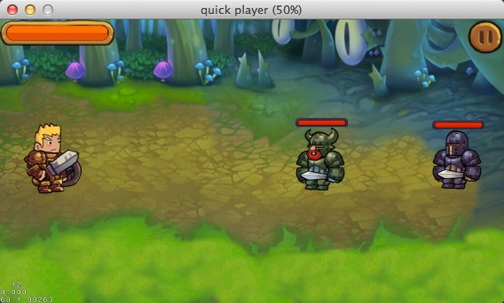

#使用Quick-Cocos2d-x搭建一个横版过关游戏(四)

在上一篇文章中我们讲到了Quick中的状态机，接下来我们来看下添加血量条之类的UI元素。

## 添加血量条

### 添加玩家血量条

用过Cocos2d-x的同学们应该都知道里面有一个CCProgressTime类，在Quick中也同样的封装了这个类，在Quick里我们是通过display.newProgressTimer()方法来创建这样一个控件的。

我们先新建一个Progress.lua文件，保存到app/ui文件夹下。粘贴以下代码进去：
	
	local Progress = class("Progress", function(background, fill)
        local progress = display.newSprite(background)
        local fill = display.newProgressTimer(fill, display.PROGRESS_TIMER_BAR)

        fill:setMidpoint(CCPoint(0, 0.5))
        fill:setBarChangeRate(CCPoint(1.0, 0))
        fill:setPosition(progress:getContentSize().width/2, progress:getContentSize().height/2)
        progress:addChild(fill)
        fill:setPercentage(100)

        return progress
    end)

	function Progress:ctor()

	end

	function Progress:setProgress(progress)
    self.fill:setPercentage(progress)
	end

	return Progress

我们来分析下代码，第一句我们在第一篇文章里面已经讲过了，在这里的作用就是创建了一个新的名为Progress的类。分别有两个参数，一个是background，一个是fill。Background参数代表的是进度条的底图，比如这个图片：

	
fill参数表示的是血量条的填充条，比如这个图片：

如果我们是使用这两个图片作为血量条的参数的话是这样调用的：

	local progress = Progress.new("#player-progress-bg.png", "#player-progress-fill.png")
	
这样我们就生成了一个血量条，是不是so easy呢！接下来我们看下血量条的实现：
	
	local progress = display.newSprite(background)
    local fill = display.newProgressTimer(fill, display.PROGRESS_TIMER_BAR)
    
这里先创建了一个progress的背景精灵，然后我们创建了一个fill的CCProgressTimer控件。

	fill:setMidpoint(CCPoint(0, 0.5))
    fill:setBarChangeRate(CCPoint(1.0, 0))
    fill:setPosition(progress:getContentSize().width/2, progress:getContentSize().height/2)
    progress:addChild(fill)
    fill:setPercentage(100)
        
这几句设置了CCProgressTimer的一些数据

- `setMidPoint`: 设置进度条的起点，CCPoint(0, 0.5)表示从最左边的中间为起点；
- `setBarChangeRate`: 设置进度条变化速度，CCPoint(1.0, 0)表示只在x轴上变化；
- `setPercentage`: 设置进度条的进度，100表示100%，50表示50%。

为了方便在外部使用，我们给Progress再添加一个setProgress方法：

	function Progress:setProgress(progress)
    	self.fill:setPercentage(progress)
	end
	
这样我们把血量条就建立起来了。在外部只需要把底图和血量变化的图传入就可以使用了。打开MainScene.lua文件，在MainScene::ctor()中添加

	self.progress = Progress.new("#player-progress-bg.png", "#player-progress-fill.png")
    self.progress:setPosition(display.left + self.progress:getContentSize().width/2, display.top - self.progress:getContentSize().height/2)
    self:addChild(self.progress)

### 给敌人添加血量条

我们攻击的敌人也是有血量条的，打开Enemy1.lua文件，在Enemy1:ctor()中添加如下代码

	self.progress = Progress.new("#small-enemy-progress-bg.png", "#small-enemy-progress-fill.png")
    local size = self:getContentSize()
    self.progress:setPosition(size.width*2/3, size.height + self.progress:getContentSize().height/2)
    self:addChild(self.progress)
    
这样，就给Enemy1添加了一个血量条。

在Enemy2.lua中执行相同的操作，给Enemy2也添加一个血量条。

## 添加暂停界面

玩家在游戏中有可能被其他事情打断，这个时候我们需要给他们提供一个暂停按钮和暂停界面。使用过Cocos2d-x的同学都知道要建立一些按钮，使用的是CCMenu，那么在Quick中怎样使用CCMenu呢？我们打开Quick下的framework/ui.lua文件，和CCMenu有关的方法有：

	function ui.newMenu(items)
	function ui.newImageMenuItem(params)
	function ui.newTTFLabelMenuItem(params)

使用的过程大概是这样的，通过`ui.newImageMenuItem`和`ui.newTTFLabelMenuItem`创建MenuItem，之后用创建的MenuItem来创建一个Menu对象。比如我们要在MainScene中添加一个暂停按钮：

	local itemPause = ui.newImageMenuItem({image="#pause1.png", imageSelected="#pause2.png",
        tag=1, listener = function(tag) self:pause() end})
    local menu = ui.newMenu({itemPause})
    itemPause:setPosition(display.right-itemPause:getContentSize().width/2, display.top-itemPause:getContentSize().height/2)
    itemSkill:setPosition(display.left + itemSkill:getContentSize().width/2, display.bottom + itemSkill:getContentSize().height/2)
    menu:setPosition(0,0)
    self:addChild(menu)
    
将以上代码放入MainScene:ctor()中，刷新Player，可以看到下面的界面：

在点击暂停按钮后，我们需要弹出一个暂停界面，在上面的实现中，我们在itemPause的参数中有一个`listener = function(tag) self:pause() end`。我们需要给MainScene实现一个pause方法。在pause方法中做的事情有：

- 暂停游戏运行
- 显示暂停界面

我们先给MainScene添加一个pause方法，加入以下代码：

	function MainScene:pause()
    	display.pause()
    	local layer = PauseLayer.new()
    	self:addChild(layer)
	end

`display.pause()`将游戏暂停下来，然后显示了一个暂停的层。这里暂停的层我们新建了一个类，名字叫做PauseLayer。我们新建一个PauseLayer.lua文件，添加一下代码：

	local PauseLayer = class("PauseLayer", function ()
    	return display.newColorLayer(ccc4(162,162,162,128))
	end)

	function PauseLayer:ctor()
    	self:addUI()
    	self:addTouch()
	end

	
	function PauseLayer:addUI()
    	local background = display.newSprite("#pause-bg.png")
    	background:setPosition(display.cx, display.cy)
    	self:addChild(background)

    	local home = ui.newImageMenuItem({
        	image = "#home-1.png",
        	imageSelected = "#home-2.png",
        	listener = function()
            	self:home()
        	end
    	})

    	local resume = ui.newImageMenuItem({
        	image = "#continue-1.png",
        	imageSelected = "#continue-2.png",
        	listener = function()
            	self:resume()
        	end
    	})

    	local backgroundSize = background:getContentSize()

    	home:setPosition(backgroundSize.width/3, backgroundSize.height/2)
    	resume:setPosition(backgroundSize.width*2/3, backgroundSize.height/2)

    	local menu = ui.newMenu({home, resume})
    	menu:setPosition(display.left, display.bottom)

    	background:addChild(menu)
	end

	function PauseLayer:addTouch()
    	local function onTouch(name, x, y)

    	end

    	self:addNodeEventListener(cc.NODE_TOUCH_EVENT, function(event)
        	return onTouch(event.name, event.x, event.y)
    	end)

    	self:setTouchEnabled(true)
	end

	function PauseLayer:resume()
    	self:removeFromParentAndCleanup(true)
    	display.resume()
	end

	function PauseLayer:home()

	end

	return PauseLayer
	
首先，我们来看下addUI()，里面新建了一个背景精灵`background`和一个菜单变量`menu`,其中菜单中有两个菜单项，分别为home和resume，一个是返回到主界面，另外一个是恢复游戏。因为我们现在是没有主界面，所以home响应函数没有任何操作，resume函数中我们先把暂停界面移除掉，之后调用`display.resume()`来恢复游戏。
接下来我们看下addTouch()。因为暂停层的图片是覆盖在游戏层上面的，如果我们不把游戏层的触摸事件拦截的话，会触发游戏层的触摸事件。addTouch就是为了在暂停层拦截掉所有的触摸事件。
