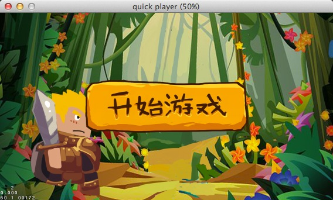
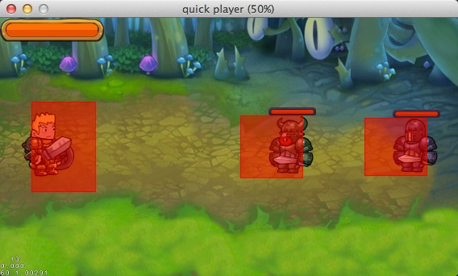
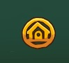
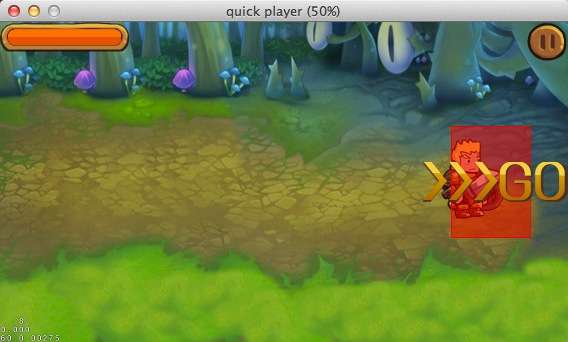

# 使用Quick-Cocos2d-x搭建一个横版过关游戏(六)

这一篇是系列文章的最后一篇了，前面不知道有没有没理解到的地方。如果有没理解的地方可以到[论坛帖子](http://www.cocoachina.com/bbs/read.php?tid=217304)里提问，我会尽量回答。

这一章里，我们会将剩下的UI界面和元素补齐，比如：游戏开始界面,过关界面，画面滚动。

## 游戏开始界面

在前面我们看到过主界面的结构，在我们的游戏开始界面中，我们只给它添加了一个背景图和一个“开始游戏”的按钮。

我们新建一个名为StartScene.lua的文件，先加入如下内容：
	
    local StartScene = class("StartScene", function()
        return display.newScene("StartScene")
    end)
    
    function StartScene:ctor()
        local background = CCSprite:create("start-bg.jpg")
        background:setPosition(display.cx, display.cy)
        addChild(background)
    end
    
    return StartScene
    
然后我们再加入一个`开始游戏`按钮，在StartScene:ctor()中添加如下代码：

	
    local item = ui.newImageMenuItem({image="#start1.png", imageSelected="#start2.png",
        listener = function()
            display.replaceScene(require("app.scenes.MainScene").new(), "fade", 0.6, display.COLOR_WHITE)
        end})
    item:setPosition(display.cx, display.cy)
    local menu = ui.newMenu({item})
    menu:setPosition(display.left, display.bottom)
    self:addChild(menu)
    
接下来我们要改变游戏的入口为StartScene。打开scripts/app目录下的MyApp.lua文件，这个文件是作为游戏的入口文件。我们打开MyApp.lua来分析下：

	local MyApp = class("MyApp", cc.mvc.AppBase)
	
这一句可以看出MyApp类是从AppBase类继承过来的，AppBase类是是Quick里的MVC架构中里的重要的一环，关于Quick的MVC我们后面再跟大家再讲。

	function MyApp:run()
    	CCFileUtils:sharedFileUtils():addSearchPath("res/")
    	display.addSpriteFramesWithFile("image/role.plist", "image/role.pvr.ccz");
    	display.addSpriteFramesWithFile("image/ui.plist", "image/ui.pvr.ccz");
    	display.addSpriteFramesWithFile("image/effect.plist", "image/effect.pvr.ccz");
    	self:enterScene("StartScene")
	end
	
MyApp:run()是界面的启动函数，在启动时我们首先添加了资源的搜索路径res，这表示我们的资源放到res目录下面。然后接下来将做的大图添加到SpriteFrameCache中。

最后面一句是启动StartScene界面，原来这里是MainScene界面，这里就是我们更改程序启动界面的地方。

好了，改完之后我们刷新Player，界面是不是变了呢？

点击开始游戏，我们进入到原来的战斗界面：

我们再回到原来的暂停界面，里面是不是有一个回到开始界面的图标呢？

我们在原来的暂停界面中把PauseLayer::home()留空了，现在我们来把这个空不上，将下面的代码复制到PauseLayer::home()函数中：
	
	display.resume()
	self:removeFromParentAndCleanup(true)
    display.replaceScene(require("app.scenes.StartScene").new())

这样，当我们点击回到开始界面的图标时，游戏就会切换到开始界面了。

## 过关

我们的游戏没有设置关卡选择界面，为了表示过关了，我们在消灭敌人后会提示说可以进下一关了，点了以后，玩家马上可以进入下一个关卡。

首先，我们要知道敌人挂了。我们添加一个table到MainScene中，在MainScene的ctor中我们添加一句	

	self.enemys = {}

在我们添加完enemy到MainScene中之后，我们也要把enemy添加到`self.enemys`中:

	self.enemys[#self.enemys+1] = enemy1
	self.enemys[#self.enemys+1] = enemy2
	
另外我们还需要给MainScene添加一个敌人死亡的消息：
	
	CCNotificationCenter:sharedNotificationCenter():registerScriptObserver(nil, function(_, enemy) self:enemyDead(enemy) end, "ENEMY_DEAD")
	
当然，要记得在退出的时候把消息取消掉。

我们打开Enemy1.lua和Enemy2.lua文件，在里面的Enemyx:dead()函数的remove()中添加这样一句：
	
	CCNotificationCenter:sharedNotificationCenter():postNotification("ENEMY_DEAD", self)

接下来，我们在MainScene里添加一个`MainScene:enemyDead(enemy)`的方法来响应敌人死亡的事件。函数内容如下：

	function MainScene:enemyDead(enemy)
    	print("EnemyDead")
    	-- 检测敌人是否已经没血了
    	self:removeEnemy(enemy)

    	-- 如果敌人全部挂了
    	if #self.enemys == 0 then
        	self:showNextLevelItem()
    	end
	end

removeEnemy的作用是将enemy从self.enemys里移除掉，具体内容可以参考github上的代码。showNextLevelItem的作用是显示继续下一关的按钮，像这样：

首先，我们在创建菜单时创建一个图片菜单项，然后隐藏，在showNextLevwelItem中我们，让他显示出来，并且执行闪烁动画：

	-- 显示进入下一关的按钮
	function MainScene:showNextLevelItem()
    	local goItem = self.menu:getChildByTag(2)
    	goItem:setVisible(true)
    	goItem:runAction(CCRepeatForever:create(CCBlink:create(1, 1)))
	end

在点击下一关按钮时，我们移动背景：

	-- 进入下一关
	function MainScene:gotoNextLevel()
    	local goItem = self.menu:getChildByTag(2)
    	transition.stopTarget(goItem)
    	goItem:setVisible(false)

    	self.background:move("left", self.player)
	end
	
在移动完成后，会发送一个背景移动结束的消息给MainScene，这时再添加敌人到场景中：

	function MainScene:backgroundMoveEnd()
    	self:addEnemys()
	end
	
## 过关界面

在我们的游戏中，因为没有等级和金币系统，所以我们的过关界面没有内容，在这里就不列出来了，在代码中有个GameoverLayer.lua实现了一个简单的过关界面，有兴趣的同学可以下来自己完成，为了T恤，加油哦！