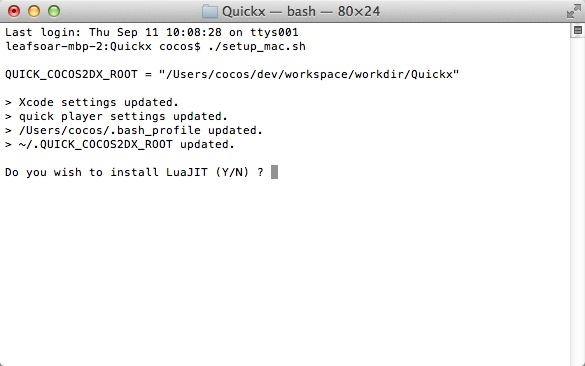
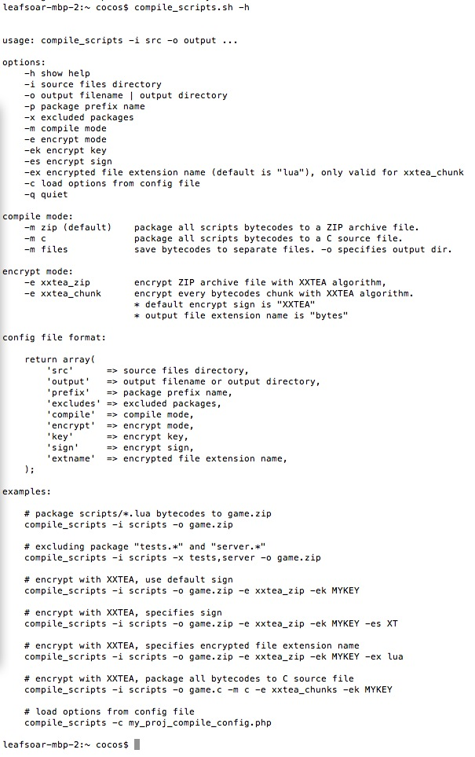
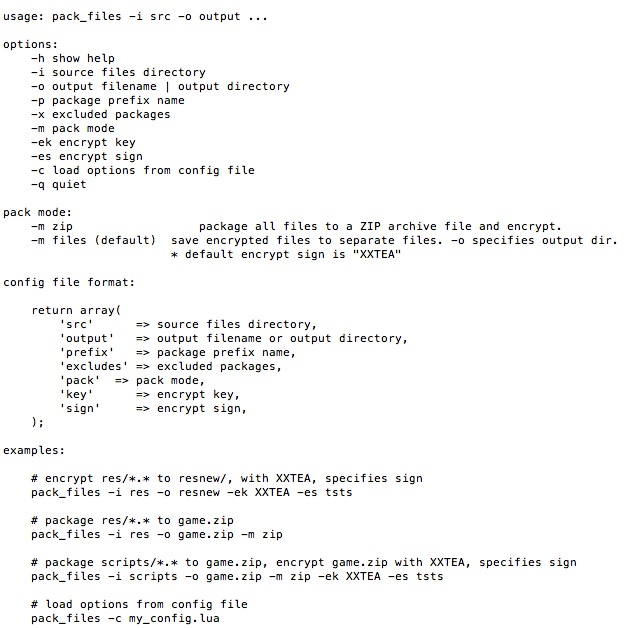

# Quick-Cocos2d-x的资源加密

在实际开发中，我们开发的游戏在发布的时候往往需要把资源加密。如果我们自己来做这些操作的话，无疑是一项很繁琐的工作。好在Quick中给我们提供了完整的一套解决方案。

在Quick中提供了两个加密的脚本，一个是对lua脚本进行加密的脚本，另外一个是对图片等资源进行加密的脚本。


我们打开Quick引擎下的bin目录，能够看到一些脚本，其中4个脚本是加密用的。

- `compile_scripts.bat`: windows下对脚本进行加密的批处理文件；
- `compile_scripts.sh`: mac或者linux下对脚本进行加密的脚本文件；
- `pack_files.bat`: windows下对资源文件打包的批处理文件；
- `pack_files.sh`: mac或者linux下对资源文件打包的脚本文件。

## 脚本加密

因为Quick里的加密是通过LuaJIT来实现的，所以我们在使用加密前必须要先安装好LuaJIT。其实我们在安装Quick的时候就可以把LuaJIT安装好。我们跳转到Quick引擎的根目录下面，执行`setup_mac.sh`。会出现下面的界面：



输入`Y`就可以安装，安装完成后我们就可以对脚本进行加密。

切换到Quick里自己的工程目录，比如我们原来建立的Brave工程。在目录下打开终端，输入

```
compile_scripts.sh -i scripts -o game.zip
```

这样在该目录下会生成一个名字叫做`game.zip`的压缩文件。我们把script文件从工程里移除掉，把`game.zip`拷到`res`文件夹下，然后打开AppDelegate.cpp文件，在

	pStack->loadChunksFromZIP("res/framework_precompiled.zip");

下增加这么一句：

	pStack->loadChunksFromZIP("res/game.zip");
	
添加完成后，我们需要将代码调用的入口进行修改。

	    size_t pos;
    while ((pos = path.find_first_of("\\")) != std::string::npos)
    {
        path.replace(pos, 1, "/");
    }
    size_t p = path.find_last_of("/\\");
    if (p != path.npos)
    {
        const string dir = path.substr(0, p);
        pStack->addSearchPath(dir.c_str());

        p = dir.find_last_of("/\\");
        if (p != dir.npos)
        {
            pStack->addSearchPath(dir.substr(0, p).c_str());
        }
    }

    string env = "__LUA_STARTUP_FILE__=\"";
    env.append(path);
    env.append("\"");
    pEngine->executeString("require 'main'");

    CCLOG("------------------------------------------------");
    CCLOG("LOAD LUA FILE: %s", path.c_str());
    CCLOG("------------------------------------------------");
    pEngine->executeScriptFile(path.c_str());
    
注释掉，添加：

	pStack->executeString("require 'main'");
	
这样的话我们就可以直接调用加密过后的文件。但需要注意的是，前面的加密方式只是把Lua编译成了二进制的文件，并没有对他进行加密处理。有时候我们需要更高的安全性。这时候要怎么做呢？

我们在终端中输入

	compile_scripts.sh -h
	
会显示很多我们需要的选项：



接下来我们来说下compile_scripts.sh参数的意义，详情如下： 

1. -h 显示当前帮助

2. -i 源码目录 

3. -o 输出文件或目录

4. -p 包前缀

5. -x 不包含在内的包 。如果你有些源文件不想被编译进去的话，将会用到这个参数，只能设置包（对应文件夹），不能指定到文件，多个包的话用,(逗号)隔开。示例：`-x app.test,server`，指的是`app/test/.*,server/.*` 这两个目录下的所有文件都不会被编译

	**编译模式**

6. -m zip 默认，生成的是zip格式文件

7. -m files 生成的是一个个文件，不打包，这个时候-o参数指的就是输出的目录
	
	**加密模式,可以对编译后的文件再进行 XXTEA 加密**

8. -e xxtea_zip 对应-m zip，对打包后的zip格式文件进行加密，之后再打包成zip格式
	
9.	-e xxtea_chunk 对编译后的文件加密，最后是否打包取决于-m

	注：xxtea_zip一定要与-m zip编译模式对应，不然会提示出错 
	
10. -ek 加密密钥。如果有-e参数后，必须要有密钥

11. -es 加密签名。可选参数，默认值为" XXTEA "，为了让引擎知道是否文件已经加密。

12. -ex 编译后的文件的后缀名 。-m files时有效，默认值为" lua "

13. -c 从一个文件加载参数列表

14. -q 生成过程不输出信息

我们同样以当前的Brave游戏为例，我们在上面的加密中并没有给包通过密钥来加密。接下来我们用密钥“12345678” 来给它加密试试。输入如下命令：

	compile_scripts.sh -i scripts -o res/game.zip -e xxtea_zip -ek 12345678
	
然后我们再修改下AppDelegate.cpp文件，在

	pStack->loadChunksFromZIP("res/framework_precompiled.zip");
	
之前添加：

	// 如果设置了 -e 和 -ek 要加上下面这句
    pStack->setXXTEAKeyAndSign("12345678", 8, "XXTEA", 5);
    // 如果设置了 -e 和 -ek -es 则要加上下面这句
    //pStack->setXXTEAKeyAndSign("aaa", 3, "XT", 2);

将应用重新打包后到手机上运行，是不是万事OK了呢！

## 资源加密

我们上面介绍的另外一个加密脚本`pack_files.sh`就是用来加密。首先，我们还是来看下`pack_files.sh`的使用帮助。在命令行输入：

	pack_files.sh -h
	
会显示下图所示的帮助信息：



从上面的帮助信息可以看出，对资源的加密有几种方式，既可以只对文件进行加密，也可以直接将文件打包成zip包，还可以压缩成zip包，并对zip包进行加密。如果是压缩成zip包后对zip包进行加密，我们就需要在AppDelegate.cpp中添加

	pStack->loadChunksFromZIP("res/压缩文件.zip");
	
我们先将image文件夹拷出来，然后再执行这里只讲解下对文件加密的过程：

	pack_files.sh -i ../image -o image -ek 12345678
	
完成后打包运行就OK了！

