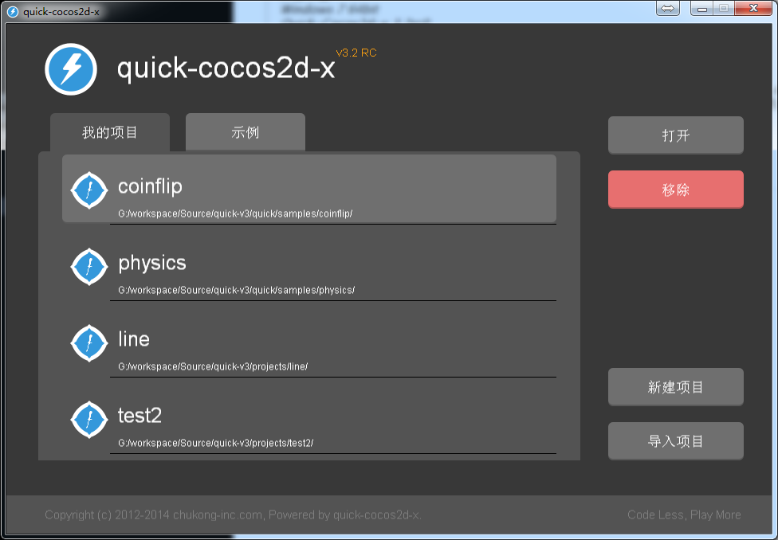
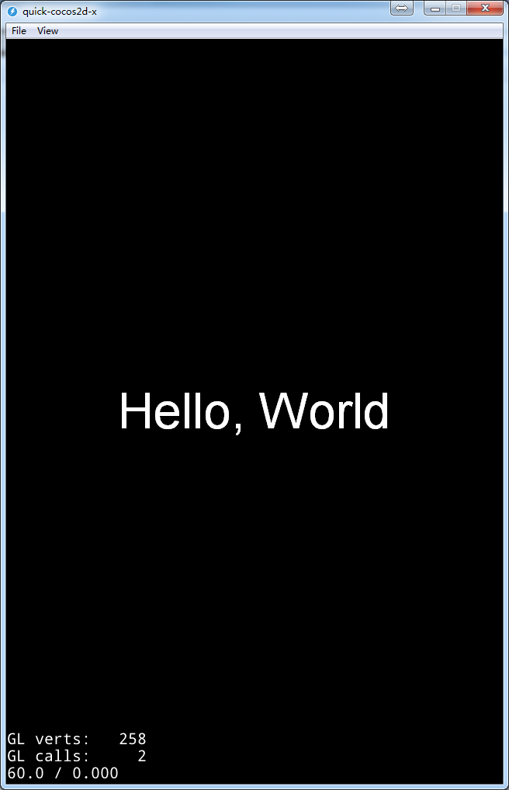
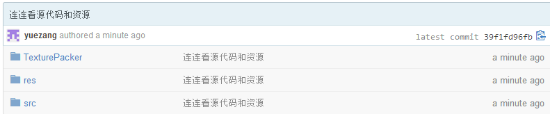

# Quick-Cocos2d-x连连看之二——一个简单连连看实现

> 开发环境:
Windows 7 64bit
Quick-Cocos2d-x 3.2rc0

>章节内容:
本章主要是介绍基于上一篇文章描述过的算法怎么来实现一个简单的连连看游戏

在[上一篇文章](http://cn.cocos2d-x.org/tutorial/show?id=1828)中，我们简单的介绍了几种连连看的实现算法，有朋友在评论中提到了A*算法。确实，A*用在连连看中确实是最合适不过的了。但是对初学者来说A*可能有点难于理解，对于这篇教程来说，我更希望看到它的人能够很容易的做出一款游戏，之后再来学习更好的算法。后面如果有需要的话，再给大家单独写一篇A*的文章。

## 新建工程

打开Quick的Player模拟器，选择“新建项目”按钮



在弹出的创建工程的界面中新建一个叫做Line的项目，填入包名等信息。完成后点击“Create Project”，然后再点击“Open Project”打开工程。打开后界面如下图所示：



从github上下载源代码，地址[点这里](https://github.com/rainswan/Line.git)，里面有三个文件夹：



其中TexturePacker文件夹是未拼接的图片，res是拼接过的图片，src是lua源代码文件。首先，我们将下载回来的res文件夹覆盖自己创建的工程的res文件夹。拷贝取下来的代码中的src\app\scenes下的.lua文件覆盖自己创建工程的src\app\scenes。

## 精灵类

我们打开src\app\scenes下的SpriteItem.lua文件。这个文件存放的是连连看的精灵类。我们来看下代码：

```
local SpriteItem = class("SpriteItem", function (type)
	type = type or defaultImage
    local sprite = display.newSprite("#fruit" .. type .. "_1.png")
    sprite.m_type = type
	return sprite
end)
```

这里创建了一个SpriteItem类，类的父类是Sprite，创建精灵的图片类型是type值传下来的。原来的Quick教程中提到过"#"号表示从SpriteFrameCache中取图片，也就是我们创建精灵的图片是fruit1_1.png之类的图片。既然是连连看的精灵，那么肯定就有个选中的状态。

```
-- 精灵显示选中状态
function SpriteItem:active()
    self:changeActiveState(true)
end

-- 精灵显示正常状态
function SpriteItem:inactive()
    self:changeActiveState(false)
end

--[[--
改变精灵状态
@param bool state 精灵状态
]]
function SpriteItem:changeActiveState(activeState)
    local frame = nil
    if (activeState) then
        frame = display.newSpriteFrame("fruit"  .. self.m_type .. '_2.png')
    else
        frame = display.newSpriteFrame("fruit"  .. self.m_type .. '_1.png')
    end

    self:setSpriteFrame(frame)
    self.m_activeState = activeState
end
```

我们图片的命名规则是这样的：fruitx_1.png表示正常状态下的图片，fruitx_2.png表示选中状态下的图片。当精灵被选中时我们切换到fruitx_2.png，注意我们这里的display.newSpriteFrame的参数并没有带“#”，因为它只能从SpriteFrameCache中读取。

在设置完图片后，我们将精灵的状态位self.m_activeState置位。

接下来，我们还要获取精灵图片的类型,点中状态,精灵大小等信息

```
--[[--
    获取精灵类型
]]
function SpriteItem:getType()
    return self.m_type
end

--[[--
    获取精灵选中状态
]]
function SpriteItem:getActive()
    return self.m_activeState
end

--[[--
    获取精灵大小
]]
function SpriteItem:getContentSize()
    if self.m_contentSize == nil then
        self.m_contentSize = self:getSpriteSize()
    end
    
    return self.m_contentSize
end

function SpriteItem:getSpriteSize()
    local sprite = display.newSprite("#fruit1_1.png")
    return sprite:getContentSize()
end

```

最后我们还要记住把SpriteItem类返回，这样才算是定义完了一个类:

```
return SpriteItem
```

## 主界面逻辑

我们回到MainScene.lua中，首先第一句

```
local SpriteItem = import(".SpriteItem")
```

导入了SpriteItem类。在Quick中要导入其他的类可以用`require`也可以用`import`，使用`import`可以使用相对路径来载入，使用`require`就必须要把完整的路径写出来，详细的解析可以看framework下的functions.lua里面的import的实现。好了，我们接下来往下看：

```
local MainScene = class("MainScene", function()
    return display.newScene("MainScene")
end)

function MainScene:ctor()
    self.m_sprites = {}
    self.m_activeSprites = {}
    
    -- 8行8列
    self.m_row = 8
    self.m_col = 8
    self.m_spriteNumber = 8
    
    -- 添加背景精灵
    display.newSprite("background.png", display.cx, display.cy):addTo(self)
    display.addSpriteFrames("fruit.plist", "fruit.pvr.ccz")

    -- 添加精灵层
    self.m_playLayer = display.newLayer()
    self.m_playLayer:setContentSize(display.width, display.height)
    self.m_playLayer:ignoreAnchorPointForPosition(false)

    -- 将精灵层设置为中间位置
    self.m_playLayer:pos(display.cx, display.cy)
    self:add(self.m_playLayer)

    -- 初始化地图
    self:initSprites()

    -- 增加触摸事件
    self:initEvents()
end
```

前3句和SpriteItem的定义类似，这里就不赘述了。我们来看下ctor()，在Quick的类的实现中，ctor()类似于C++中的构造函数，当创建对象时会自动去调用ctor()函数。我们在ctor()函数中设置了一些生成连连看地图的信息，比如:

```
	-- 8行8列
    self.m_row = 8
    self.m_col = 8
    
    -- 8种精灵
    self.m_spriteNumber = 8
```
然后我们创建一个背景的精灵和一个playLayer来放精灵。接下来我们就应该初始化地图，初始化地图的内容放在了initSprites()函数。还记得我们在上一篇文章里提到过的生成地图算法嘛？现在就是它的实现了。

### 生成地图

1. 首先，我们需要生成一半的数组，这一半的数组中的精灵的类型我们也随机生成，当然也可以自己拟定好之后再生成。接着把生成的精灵全部插入self.m_sprites table中。

    ```
    -- 生成一半的精灵
    for i = 1, self.m_row * self.m_col / 2 do
        math.newrandomseed()
        local type = math.random(1, self.m_spriteNumber)
        local sprite = SpriteItem.new(type)
        table.insert(self.m_sprites, sprite)
    end
    ```

2. 接着，我们复制已经创建的一半到另外一半中

	```
    -- 拷贝到另外一半
    for i = 1, #self.m_sprites do
        local type = self.m_sprites[i]:getType()
        local sprite = SpriteItem.new(type)
        table.insert(self.m_sprites, sprite)
    end
	```

3. 我们把数组的顺序打乱

    ```
    -- 随机打乱顺序
    for seq = 1, 13*2 do

        for i = 1, #self.m_sprites do
        	-- 随机生成要替换的数组行列
            local row_org = math.random(1, self.m_row)
            local col_org = math.random(1, self.m_col)

            local row_dest = math.random(1, self.m_row)
            local col_dest = math.random(1, self.m_col)

            local sprite_org = self.m_sprites[(row_org-1)*self.m_col + col_org]
            local sprite_dest = self.m_sprites[(row_dest-1)*self.m_col + col_dest]

			-- 交换数据
            self.m_sprites[(row_org-1)*self.m_col + col_org], self.m_sprites[(row_dest-1)*self.m_col + col_dest]
            = self.m_sprites[(row_dest-1)*self.m_col + col_dest], self.m_sprites[(row_org-1)*self.m_col + col_org]
        end
    end
	```

地图生成的步骤就上面几步，接下来我们只需要把精灵按照数组中的顺序显示出来就可以了。

```
-- 显示精灵
local size = SpriteItem:getContentSize()
for row = 1, self.m_row do
    for col = 1, self.m_col do
        local sprite  = self.m_sprites[(row-1)*self.m_col + col]:pos(col * size.width, row * size.height)
        sprite:setRowAndCol(row, col)
        self.m_playLayer:addChild(sprite)
    end
end
```

为了更好的处理精灵过多而超出显示界面的问题，我们对层进行缩放：

```
local size = SpriteItem:getContentSize()
local playLayerWidth = (self.m_col+1)*size.width
local playLayerHeight = (self.m_row+1)*size.height
self.m_playLayer:setContentSize(playLayerWidth, playLayerHeight)
if playLayerWidth > display.width then
    self.m_playLayer:setScale(display.width/playLayerWidth)
end
self.m_playLayer:pos(display.cx, display.cy)
```

### 触摸处理

在Quick里开启触摸响应需要注册触摸响应函数，如下代码注册一个叫做touchCell的触摸响应函数:

```
function MainScene:initEvents()
    self:setTouchEnabled(true)
    self.m_playLayer:addNodeEventListener(cc.NODE_TOUCH_EVENT, handler(self, self.touchCell))
end
```

我们在touchCell()函数中来处理连连看中的消除等操作。我们来看下touchCell中的代码：

1. 首先，我们需要获取点中的是哪个精灵。

	```
    local sprite = self:itemOfPoint(pos)
	```

	itemOfPoint的定义如下:

    ```
	function MainScene:itemOfPoint(point)
        local item = nil
        local rect = nil

        point = self.m_playLayer:convertToNodeSpace(point)
        for row = 1, self.m_row do
            for col = 1, self.m_col do
                item = self.m_sprites[(row-1) * self.m_col + col]
                if (item) then
                    rect = cc.rect(item:getPositionX() - (item:getContentSize().width / 2),
                                    item:getPositionY() - (item:getContentSize().height / 2),
                                    item:getContentSize().width,
                                    item:getContentSize().height)

                    if (cc.rectContainsPoint(rect, point)) then
                        return item
                    end
                end
            end
        end
	end
	```

	其实检查哪个精灵被选择就是遍历所有的精灵，看哪个精灵的范围包含了选中的点，选中后返回就行了。

2. 继续往下的话就是我们的判断算法，大概流程是这样的:

	* 首先判断是否有精灵被选中；
	* 如果有精灵被选中，那么进入消除的步骤；
	* 如果没有精灵被选中，选中点中的精灵。

	我们为了判断是否有精灵被选中，我们在精灵类SpriteItem里添加了一个getActive()函数。如果sprite:getActive()为false表示未选中精灵，那么就直接选中精灵，并加入到m_activeSprits table中。

	```
    if #self.m_activeSprites == 0 then
    -- 没有选中任何的精灵
    sprite:active()
    table.insert(self.m_activeSprites, sprite)
	```

    如果有精灵被选中了就要进入判断算法中了。

3. 在代码中，我们可以看到三个判断的函数，分别是：

	* isDirectLink:判断是否能直接连接
	* isOneCornerLink:判断是否能通过一次拐角连接
	* isTwoCornerLink:判断是否能通过两次拐角连接

	在这里我们只讲解下是否能直接连接的检测。其他的类似，我们就不多讲了。

    首先我们判断两个精灵是不是相同的精灵，如果是相同的直接返回：

    ```
    local firstRow, firstCol = posa.row, posa.col
    local secondRow, secondCol = posb.row, posb.col

    -- 相同位置的精灵
    if firstRow == secondRow and firstCol == secondCol then
        return false
    end
	```

    接着我们判断两个精灵是同一行或者是同一列，如果是同一行或者同一列，中间没有隔着其他精灵的话，说明两个精灵是可以连通的。如果有其他精灵的话，说明不能直接连通。

    ```
    if firstRow == secondRow then
        -- 相同行的精灵

        if firstRow == 1 or firstRow == self.m_row then
            return true
        end

        local steps = secondCol - firstCol
        for i = steps/math.abs(steps), steps, steps/math.abs(steps) do
            local sp = self.m_sprites[(firstRow-1)*self.m_col + firstCol + i]
            local row, col = firstRow, firstCol+i
            if col == secondCol then
                return true
            elseif sp ~= nil then
                return false
            end
        end

    elseif firstCol == secondCol then
        -- 相同列的精灵

        if firstCol == 1 or firstCol == self.m_col then
            return true
        end

        local steps = secondRow - firstRow
        for i = steps/math.abs(steps), steps, steps/math.abs(steps) do
            local sp = self.m_sprites[(firstRow-1+i)*self.m_col + firstCol]
            local row, col = firstRow+i, firstCol
            if row == secondRow then
                return true
            elseif sp ~= nil then
                return false
            end
        end
    else
        return false
    end
	```

其他的情况下的算法类似，只不过多了一个遍历的过程。

这篇文章就介绍到这里，如果大家有什么问题或者意见的话欢迎留言。谢谢！