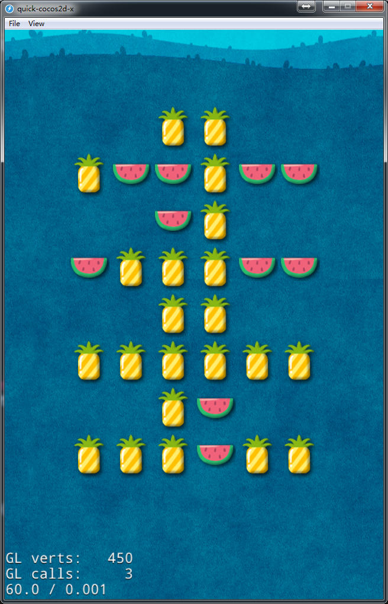

# 连连看之模板生成法

> 在[《连连看算法分析》](http://cn.cocos2d-x.org/tutorial/show?id=1828)这篇文章中我们提到过几种地图生成的方法。在[上一篇文章](http://cn.cocos2d-x.org/tutorial/show?id=1867)里我们介绍了怎样用随机数的方法来生成地图。这篇文章我们就来看看通过模板来生成算法。当然，这里提供的文章仅供参考，如果有什么不对，还请大家批评指正。

## 模板法介绍

所谓模板法，其实很简单，就是配置好每个关卡的数据，然后读取关卡的数据后，生成地图。比如，我们想要第一关生成一个3x3的地图，第二关生成5x5的地图，那么我们只需要在关卡里调整行和列的数据就可以了。再比如，我们想要生成一个“1”字形的关卡，我们可以在配置文件中编辑好关卡的地形，然后导入到游戏中就可以了。

## 关卡配置

上面介绍了模板法的概念，接下来，我们来看下怎么在游戏中使用模板法来生成一个连连看的地图！我们先看下我们在一个关卡数据里需要配置哪些数据呢？

* 一行有几个精灵
* 一列有几个精灵
* 地图

前面两项是用来定义地图的大小，我们主要关心后面的地图布局该是怎么配置的。比如我们在《天天星连萌》里看到这种布局的连连看：


我们来讲下怎么配置这种地图。

首先，我们需要确定用哪种格式来存放配置数据。常用的配置文件格式有：JSON，XML，Lua，自定义。四种格式各有优缺点，JSON配置方便，Quick自带解析，XML配置比较繁琐，但是使用范围广。在Quick中我们更广泛使用的是Lua，毕竟是亲儿子嘛！在C++中更常用的是JSON。当然，这里也只是给大家建议。我们这里以Lua作配置文件来给大家做讲解。

首先，我们来拟定下配置文件的格式，每行有几个精灵和每列有几个精灵其实在每个关卡都差不多（前提是需要的功能没这方面的需求），这样的话我们我们只需要配置每个关卡不同的数据就行了。下面是一个配置的模板：

```
local levels =
{
	rowNumber = 8,
	colNumber = 8,
	levelMap = {
        {
            0,1,1,1,1,1,1,0,
            0,0,0,1,1,0,0,0,
            0,1,1,1,1,1,1,0,
            0,0,0,1,1,0,0,0,
            0,1,1,1,1,1,1,0,
            0,0,0,1,1,0,0,0,
            0,1,1,1,1,1,1,0,
            0,0,0,1,1,0,0,0,
        }
    }
}

return levels
```

因为Lua中的table是有序的，所以我们直接通过1,2,3,4的方式就能读取地图数据。这样配置的数据我们可以直接在游戏中读取并显示出来。

## 关卡显示

配置好关卡之后，我们需要在游戏中把它们显示出来。在src/app下新建一个levels文件夹，里面放我们刚才配置好的关卡数据。

打开MainScene.lua文件，我们需要对原来的代码略做修改。首先，我们需要给MainScene新增加一个initSpritesByLevel函数。

```
--[[
读取关卡信息
]]
function MainScene:initSpritesByLevel(level)
    local levelInfo = require("app.levels.levels")
    if levelInfo == nil then
        return
    else
        self.m_sprites = {}
        self.m_activeSprites = {}

        -- 添加精灵层
        if self.m_playLayer then
            self.m_playLayer:removeSelf()
        end

        self.m_playLayer = display.newLayer()
        self.m_playLayer:setContentSize(display.width, display.height)
        self.m_playLayer:ignoreAnchorPointForPosition(false)

        -- 将精灵层设置为中间位置
        self.m_playLayer:pos(display.cx, display.cy)
        self:add(self.m_playLayer)

        -- 初始化地图
        self:initSprites(levelInfo.levelMap[level])
    end
end
```

这个函数的主要作用是读取地图配置并且生成对应的地图，因为我们的配置文件本身就是Lua文件，所以可以直接读取里面的table，操作里面的字段，这就是在Quick里面使用Lua作为配置文件的好处。

在读取完配置文件之后，我们就要根据地图的配置来生成地图。我们把原来的initSprites()改成这样:

```
--[[--
初始化精灵数组
]]
function MainScene:initSprites(levelSprites)

    local sprites = {}
    local spriteNum = 0
    for i = 1, #levelSprites do
        if levelSprites[i] ~= blank then
            spriteNum = spriteNum + 1
        end
    end

    -- 生成一半的精灵
    for i = 1, spriteNum / 2 do
        math.newrandomseed()
        local type = math.random(1, self.m_spriteNumber)
    	local sprite = SpriteItem.new(type)
    	table.insert(sprites, sprite)
    end

    -- 拷贝到另外一半
    for i = 1, #sprites do
        local type = sprites[i]:getType()
        local sprite = SpriteItem.new(type)
        table.insert(sprites, sprite)
    end

    -- 随机打乱顺序
    for seq = 1, 13*2 do
        math.newrandomseed()
        for i = 1, #sprites do
            local org = math.random(1, #sprites)
            local dest = math.random(1, #sprites)

            if org ~= dest then
                sprites[org], sprites[dest] = sprites[dest], sprites[org]
            end
        end
    end

    local j = 1
    for i = 1, self.m_row * self.m_col do
        if levelSprites[i] == blank then
            self.m_sprites[i] = blank
        else
            self.m_sprites[i] = sprites[j]
            j = j + 1
        end
    end

    -- 显示精灵
    local size = SpriteItem:getContentSize()
    for row = 1, self.m_row do
        for col = 1, self.m_col do
            local sprite  = self.m_sprites[(row-1)*self.m_col + col]
            if sprite ~= blank then
                sprite:pos(col * size.width, row * (size.height+10))
                sprite:setRowAndCol(row, col)
                self.m_playLayer:addChild(sprite)
            end
        end
    end
    
    local size = SpriteItem:getContentSize()
    local playLayerWidth = (self.m_col+1)*size.width
    local playLayerHeight = (self.m_row+1)*size.height
    self.m_playLayer:setContentSize(playLayerWidth, playLayerHeight)
    if playLayerWidth > display.width then
        self.m_playLayer:setScale(display.width/playLayerWidth)
    end
    self.m_playLayer:pos(display.cx, display.cy)
end
```

上面的代码其实结合了随机地图生成的方式和模板生成方式两种，在配置中为1的表示地图上有精灵，为0表示没有精灵。在为1的位置随机生成精灵。生成后的地图如下所示：


