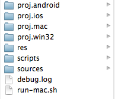
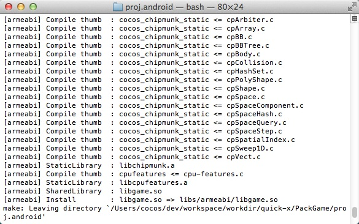
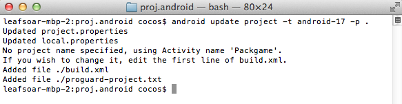
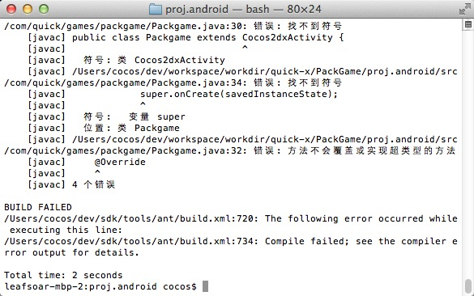
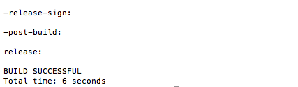
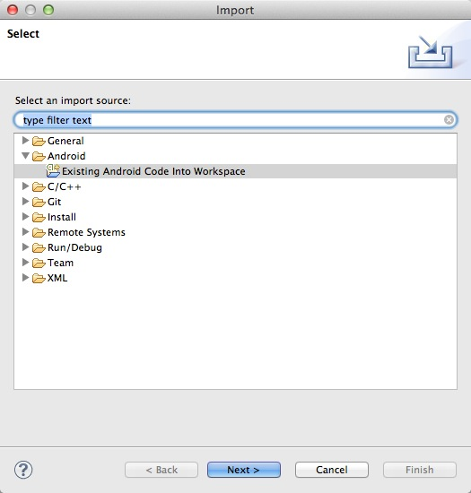
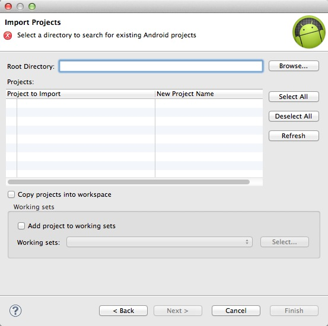

# Quick-Cocos2d-x的Android打包教程

## 环境要求

要用quick开发游戏，当然首先环境必须配置好了。关于环境配置的教程有很多，这里不多讲，下面这些是必须的：

- Quick-Cocos2d-x引擎
- JDK
- android-sdk
- android-ndk(r9以上)
- Ant

下面的是可选安装的软件：

- Eclipse/AndroidStudio/Cocos Code IDE/Intellij IDEA
- Visual Studio
- Lua 5.1.4

安装必须环境以后，在Mac下，我们打开quick的player，创建一个游戏。在Windows上Player现在不能创建工程，我们可以到quick下的bin目录里执行`create_project.bat`来创建游戏。比如我们现在创建了一个游戏，名字叫PackGame，创建后的工程如下图所示：

## 编译项目

### Android

#### 1.编译C++代码和拷贝资源

我们游戏的代码目录下可以看到有一个叫做proj.android的文件夹，要编译android的项目我们先要进入proj.android文件夹。在proj.android目录下执行`./build_native(Mac)`或者`build_native.bat(windows)`拷贝资源和编译C++文件。

如果结果是上面显示的那种的话，表示编译成功，如果报错的话就排除错误再编译一次。编译完成后我们可以在proj.android目录下面的assets中有res和scripts文件夹，这两个文件夹就是我们的资源文件夹。

#### 2.打包Android工程并运行

打包Android工程常用的有两种方法，一种是通过Ant来打包，还有一种是通过Eclipse来打包。

##### 1. 使用Ant

在我们安装完Ant之后，并不能马上就用来打包，我们要先生成Android的配置文件。执行命令：

	android update project -t android-17 -p . -n PackGame
	
我示范的是使用4.2来作为开发sdk，所以我这里的平台用的android-17。-t指定使用的系统版本，-p表示工程路径。执行完成的结果如下图：

接下来我们执行ant命令，ant能够生成两种包，一种是debug，这种使用的是debug签名；还有一种是release包，这种就要使用自己的签名了。在这里我们使用debug的包，执行命令：

	ant debug
	
执行到这里呢会发现执行出错了，错误信息如下图：

这是因为我们没有把cocos2d-x的java代码import进来导致的。

打开proj.android下面的project.properties文件，把里面的

	android.library.reference=false
	
改成

	android.library.reference.1=../../lib/cocos2d-x/cocos2dx/platform/android/java
	
然后再执行一次ant debug。完美，一次通过了！

接下来我们连接上手机，在命令行输入(**要在proj.android目录下**)
	
	adb install bin/PackGame-debug.apk
	
安装后就可以在手机上运行了。

##### 2.使用Eclipse

使用Eclipse打包相对来说要简单的多，打开Eclipse，点击`File->Import`，在弹出的界面中选择`Existing Android Code Into Workspace`：

点击`Next`，进入下一个界面：

选择刚才创建的工程，导入完成后点击`Finish`结束导入，相同的步骤导入cocos2d-x的java代码(`Quick目录洗lib/cocos2d-x/cocos2dx/platform/android/java文件夹`)。

导入完成后，在工程PackGame上点击右键，选择`Properties`，在选择Android选项卡：

在Library中点击`Add`，添加`libcocos2dx`，点击`OK`保存设置。点击工具栏上的运行按钮运行游戏。

### iOS

在iOS上的调试和运行要简单的多，我们只需要打开proj.ios文件夹下的xcode工程文件，点击`Run`就可以直接运行了。
